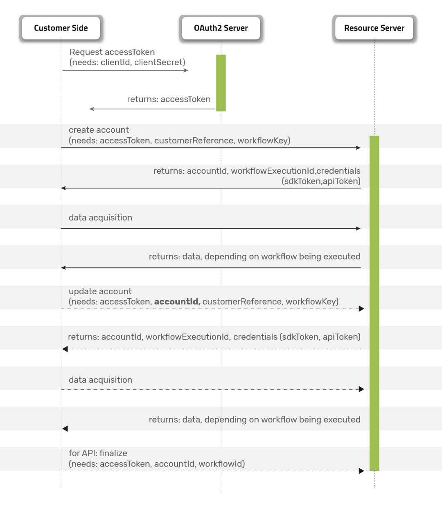

# Introduction
The Jumio KYX Platform API allows you to manage your user journeys. It allows you to create and update accounts for your users, prompt them to provide data such as a photo ID and selfie, and get identity verification results in real time so you can complete their onboarding.

The KYX Platform API is user-based and highly flexible, allowing various workflows that can be easily combined into a single user journey. Each workflow defines a single transaction executing a series of specific tasks, such as data extraction and a liveness check. Multiple workflows can be executed on the same account. Your workflows can execute functionality from several Jumio products, including:

* ID Verification: Is this photo ID valid?
* Identity Verification: Is this person who they say they are?

The following diagram shows several possible workflows:


| ℹ️&nbsp;&nbsp; Some functionalities described in this document might be unavailable, depending on the scope of your license with Jumio. Contact your Jumio Solutions Engineer if you have any questions.
|:----------|

### Implementation Steps
1. Account Creation
2. Account Update
3. Data Acquisition
4. Finalization

## Table of Contents
- [Authentication and Encryption](#authentication-and-encryption)
  - [Request Access Token](#request-access-token)
  - [Access Token Timeout](#access-token-timeout)
  - [Workflow Transaction Token Timeout](#workflow-transaction-token-timeout)
- [Account Creation](#account-creation)
- [Account Update](#account-update)
  - [Request](#request)
  - [Response](#response)
- [Workflow Descriptions](#workflow-descriptions)
- [Data Acquisition](#data-acquisition)
  - [SDK](#sdk)
    - [Android](#android)
    - [iOS](#ios)
  - [API](#api)
    - [Request](#request-1)
    - [Response](#response-1)
    - [Finalization](#finalization)
  - [WEB](#web)
    - [Initiating](#initiating)
    - [Displaying the Web Client](#displaying-the-web-client)
    - [After the User Journey](#after-the-user-journey)
    - [Supported Environments](#supported-environments)
- [Callback](#callback)
  - [Best Practices](#best-practices)
  - [Jumio Callback IP Addresses](#jumio-callback-ip-addresses)
  - [Callback Parameters](#callback-parameters)
- [Retrieval](#retrieval)
  - [Best Practices](#best-practices-1)
    - [Request](#request-2)
  - [Available Retrieval APIs](#available-retrieval-apis)
    - [Get Status](#get-status)
    - [Get Workflow Details](#get-workflow-details)
- [Health Check](#health-check)
  - [Request](#request-3)
  - [Response](#response-2)
- [Deletion](#deletion)
  - [Usage](#usage-2)
    - [Request](#request-4)
  - [Available Deletion APIs](#available-deletion-apis)
    - [Account Deletion](#account-deletion)
    - [Workflow Deletion](#workflow-deletion)

# Authentication and Encryption
API calls are protected using either HTTP Basic Authentication or OAuth2.

| ⚠️&nbsp;&nbsp; Never share your API token, API secret, or OAuth2 credentials with anyone — not even Jumio Support!
|:----------|

The Account Management Service initiates the acquisition process and returns:

* either a JSON Web Token (JWT), which can be used to authenticate to the Jumio backend system to use with the SDK
* or Redirect-URLs, which can be used to upload documents using the other channels

At the moment, your Basic Auth credentials are constructed using your API token as the User ID and your API secret as the password. You can view and manage your API token and secret in the Customer Portal under:
* __Settings > API credentials > API Users__

## OAuth2
Your new OAuth2 credentials are constructed using your API token as the Client ID and your API secret as the Client secret. You can view and manage your API token and secret in the Customer Portal under:
* __Settings > API credentials > OAuth2 Clients__

Client ID and Client secret are used to generate an OAuth2 access token. OAuth2 has to be activated for your account. Contact your Jumio Account Manager for activation.

### Access Token URL (OAuth2)
* US: `https://auth.amer-1.jumio.ai/oauth2/token`
* EU: `https://auth.emea-1.jumio.ai/oauth2/token`
* SG: `https://auth.apac-1.jumio.ai/oauth2/token`

The [TLS Protocol](https://tools.ietf.org/html/rfc5246) is required to securely transmit your data, and we strongly recommend using the latest version. For information on cipher suites supported by Jumio during the TLS handshake see [supported cipher suites](https://github.com/Jumio/implementation-guides/blob/master/netverify/supported-cipher-suites.md).

| ℹ️&nbsp;&nbsp; Calls with missing, incorrect or suspicious headers or parameter values will result in HTTP status code __400 Bad Request Error__ or __403 Forbidden__
|:----------|

## Examples

### Request Access Token
```
curl --request POST --location 'https://auth.amer-1.jumio.ai/oauth2/token' \
    --header 'Accept: application/json' \
    --header 'Content-Type: application/x-www-form-urlencoded' \
    --data-raw 'grant_type=client_credentials' \
    --basic --user CLIENT_ID:CLIENT_SECRET
```

### Response
```
{
  "access_token": "YOUR_ACCESS_TOKEN",
  "expires_in": 3600,
  "token_type": "Bearer"
}
```

## Access Token Timeout
Your OAuth2 access token is valid for 60 minutes. After the token lifetime is expired, it is necessary to [generate a new access token.](#authentication-and-encryption)

## Workflow Transaction Token Timeout
The token lifetime is set to 30 minutes per default. It can be configured via the [Jumio Customer Portal](https://github.com/Jumio/implementation-guides/blob/master/netverify/portal-settings.md) and can be overwritten using the API call (`tokenLifetime`). Within this token lifetime the token can be used to initialize the SDK, API or Web journey.

As soon as the workflow (transaction) starts, a 15 minutes session timeout starts. For each action performed (capture image, upload image) the session timeout will reset, and the 15 minutes will start again.

# Account Creation
Create a new account for your end user by using the following API endpoint and below mentioned request headers and request body:

HTTP Request Method: __POST__
* US: `https://account.amer-1.jumio.ai/api/v1/accounts`
* EU: `https://account.emea-1.jumio.ai/api/v1/accounts`
* SG: `https://account.apac-1.jumio.ai/api/v1/accounts`

## Request Headers
The following fields are required in the header section of your Request

`Accept: application/json`   
`Content-Type: application/json`    
`Content-Length:`  see [RFC-7230](https://tools.ietf.org/html/rfc7230#section-3.3.2)   
`Authorization:` see [RFC6749](https://tools.ietf.org/html/rfc6749)   
`User-Agent: YourCompany YourApp/v1.0`   

| ⚠️&nbsp;&nbsp; Jumio requires the __User-Agent__ value to reflect your business or entity name for API troubleshooting.
|:----------|

| ℹ️&nbsp;&nbsp; Calls with missing or suspicious headers, suspicious parameter values, or without OAuth2 will result in HTTP status code __403 Forbidden__
|:----------|

## Request Body
The body of your initiate API request allows you to:

* provide your own internal tracking information for the user and transaction.
* specify what user information is captured and by which method.
* preset options to enhance the user journey.

Values set in your API request will override the corresponding settings configured in the Customer Portal.

(Mandatory parameters in bold.)

| Parameter                      | Type           | Max. Length           | Notes          |
|--------------------------------|----------------|-----------------------|----------------|
| __customerInternalReference__  | string         | 100                   | Customer internal reference for a request to link it in the customer backend (must not contain any PII)              |
| __workflowDefinition__         | object         |                       | Definition of the specific documents necessary to execute for the particular capabilities on them.                   |
| __workflowDefinition.key__     | object         |                       | Key of the workflow definition which you want to execute<br>See [Workflow Definition Keys](#workflow-definition-keys)                                      |
| workflowDefinition.credentials | array (object) |                       | Optional workflow definition object part to customize acquiring process and workflow process.<br>Possible values: <br>See [workflowDefinition.credentials](#request-workflowdefinitioncredentials)       |
| userReference                  | string         | 100                   | Reference for the end user in the customer backend (must not contain any PII)                |
| reportingCriteria              | string         | 255                   | Additional information provided by a customer for searching and aggregation purposes         |
| callbackUrl                    | string         | 255                   | Definition of the callback URL for this particular request. [Overrides callback URL](https://github.com/Jumio/implementation-guides/blob/master/netverify/netverify-web-v4.md#callback-error-and-success-urls) in the Customer Portal.                  |
| tokenLifetime                  | string         | minimum: 5m, maximum: 60d,<br>default: 30m | Should be a valid date period unit definition:<br>s - seconds<br>m - minutes<br>h - hours<br>d - days<br>Example: '1d' / '30m' / '600s'<br>[Overrides Authorization token lifetime](https://github.com/Jumio/implementation-guides/blob/master/netverify/netverify-web-v4.md#authorization-token-lifetime) in the Customer Portal. |
| web | object | | _Web parameters are only relevant for the WEB channel._ |
| web.successUrl | string | 255 | URL to which the browser will send the end user at the end of a successful web acquisition user journey. [Overrides success URL](https://github.com/Jumio/implementation-guides/blob/master/netverify/netverify-web-v4.md#callback-error-and-success-urls) in the Customer Portal. |
| web.errorUrl | string | 255 | URL to which the browser will send the end user at the end of a failed web acquisition user journey. [Overrides error URL](https://github.com/Jumio/implementation-guides/blob/master/netverify/netverify-web-v4.md#callback-error-and-success-urls) in the Customer Portal. |
| web.locale | string | 5 | Renders content in the specified language.<br>Overrides [Default locale](https://github.com/Jumio/implementation-guides/blob/master/netverify/netverify-web-v4.md#default-locale) in the Customer Portal.<br>See [supported locale values](#supported-locale-values). |

#### Request workflowDefinition.credentials

| Parameter              | Type           | Max. Length          | Notes                                                                     |
|------------------------|----------------|----------------------|---------------------------------------------------------------------------|
| category               | string         |                      | Possible values:<br>• ID<br>• FACEMAP<br>• DOCUMENT<br>•	SELFIE           |
| country                | object         |                      | Possible values:<br>• country.predefinedType <br>• country.values         |
| country.predefinedType | string         |                      | Possible values:<br>• DEFINED (default: end user is not able to change country)<br>• RECOMMENDED (country is preselected, end user is still able to change it) |
| country.values         | array (string) | See possible values. | Define at least one ISO 3166-1 alpha-3 country code for the workflow definition.<br>Possible values: <br>•	[ISO 3166-1 alpha-3 country code](http://en.wikipedia.org/wiki/ISO_3166-1_alpha-3) |
| type                   | object         |                      | Possible values:<br>• type.predefinedType <br>• type.values               |
| type.predefinedType    | object         |                      | Possible values:<br>• DEFINED (default: end user is not able to change document type)<br>• RECOMMENDED (type is preselected, end user is still able to change it) |
| type.values            | array (string) | See possible values. | Defined number of credential type codes. <br>Possible values:<br>If `category` = ID:<br>• ID_CARD<br>• DRIVING_LICENSE<br>• PASSPORT<br>• VISA<br>If `category` = FACEMAP:<br>• IPROOV_STANDARD<br>• IPROOV_PREMIUM (SDK channel only)<br>• JUMIO_STANDARD    |

## Response
Unsuccessful requests will return HTTP status code __400 Bad Request, 401 Unauthorized, 403 Forbidden__ or __404 Not Found__ (in case of a failed update scenario) if the scan is not available.

Successful requests will return HTTP status code __200 OK__ along with a JSON object containing the information described below.

| Parameter                     | Type           | Notes                                                                     |
|-------------------------------|----------------|---------------------------------------------------------------------------|
| timestamp                     | string         | Timestamp (UTC) of the response.<br>Format: YYYY-MM-DDThh:mm:ss.SSSZ      |
| account                       | object         | Possible values:<br>• account.id                                          |
| account.id                    | string         | UUID of the account                                                       |
| sdk                           | object         | Possible values:<br>• sdk.token <br><br> _SDK parameters are only relevant for the SDK channel._         |
| sdk.token                     | string         | JWT token for performing any action <br><br> _SDK parameters are only relevant for the SDK channel._     |
| workflowExecution             | object         | Possible values:<br>• workflowExecution.id<br>• workflowExecution.credentials                        |
| workflowExecution.id          | string         | UUID of the workflow                                                      |
| workflowExecution.credentials | array (object) | Credential response<br>See [workflowExecution.credentials](#response-workflowdefinition.credentials) |
| web                           | object         | Possible values:<br>• web.href <br><br> _Web parameters are only relevant for the WEB channel._ |
| web.href                      | string         | _Web parameters are only relevant for the WEB channel._ |

### Response workflowExecution.credentials
| Parameter             | Type                    | Notes                                                                                                                           |
|-----------------------|-------------------------|-----------------------------------------------------------------------------|
| id                    | string                  | UUID of the credentials                                                     |
| category              | string                  | Credential category.<br>Possible values:<br>• ID<br>•	FACEMAP<br>• DOCUMENT<br>• SELFIE |
| country               | object                  | Defined at least one ISO 3166-1 alpha-3 country code for the workflow definition.<br>Possible values: <br>•	[ISO 3166-1 alpha-3 country code](http://en.wikipedia.org/wiki/ISO_3166-1_alpha-3) |
| type                  | object                  | Defined number of credential type codes.<br>Possible values: <br>• ID_CARD<br>•	DRIVING LICENSE<br>• PASSPORT<br>• VISA |
| allowedChannels       | array                   | Channels which can be used to upload particular credential<br>Possible values:<br>• WEB<br>• API<br>•	SDK |
| api                   | object                  | Available actions for the API calls, actions can be omitted due to unavailability<br>Possible values:<br>• api.token<br>•api.parts<br>• api.workflowExecution <br><br> _API parameters are only relevant for the API channel._ |
| api.token             | string                  | JWT token for performing any action for API<br><br>_API parameters are only relevant for the API channel._ |
| api.parts             | object                  | href to manage parts for the account credential<br>Possible values:<br>• FRONT<br>•	BACK<br>• FACE<br>• FACEMAP <br><br> _API parameters are only relevant for the API channel._ |
| api.workflowExecution | string                  | href to manage the acquisition and workflow processing <br><br>_API parameters are only relevant for the API channel._ |

## Examples

### Initiate Account
```
curl --request POST --location 'https://account.amer-1.jumio.ai/api/v1/accounts' \
    --header 'Content-Type: application/json' \
    --header 'User-Agent: User Demo' \
    --header 'Authorization: Bearer
    YOUR_ACCESS_TOKEN' \
    --data-raw '{
        "customerInternalReference": "CUSTOMER_REFERENCE",
        "workflowDefinition": {
            "key": 2,
            "credentials": [
                {
                    "category": "ID",
                    "type": {
                        "values": ["DRIVING_LICENSE", "ID_CARD", "PASSPORT"]
                    },
                    "country": {
                        "values": ["USA", "CAN", "AUT", "GBR"]
                    }
                }
            ]
        },
        "callbackUrl": "YOUR_CALLBACK_URL",
        "userReference": "YOUR_USER_REFERENCE",
    }'
```

# Account Update
After you have [created an account](#account-creation) for an end user, you can use this API to update that account. You will use this API endpoint for every new workflow (transaction) you need to initialize for that end user.

Updating an account is very similar to creating one; the request headers and body are the same in both cases. The difference is that you pass the `accountId` to the endpoint and use PUT instead of POST.

## Request
HTTP Request Method: __PUT__
* US: `https://account.amer-1.jumio.ai/api/v1/accounts/<accountId>`
* EU: `https://account.emea-1.jumio.ai/api/v1/accounts/<accountId>`
* SG: `https://account.apac-1.jumio.ai/api/v1/accounts/<accountId>`

### Request Headers
Please refer to [Account Create section.](#request-headers)

### Request Body
Please refer to [Account Create section.](#request-body)

## Response
Please refer to [Account Create section.](#response)

## Examples

### Request
```
curl --location --request PUT 'https://account.amer-1.jumio.ai/api/v1/accounts/<accountId>' \
--header 'Content-Type: application/json' \
--header 'User-Agent: User Demo' \
--header 'Authorization: Bearer
YOUR_ACCESS_TOKEN' \
--data-raw '{
    "customerInternalReference": "CUSTOMER_INTERNAL_REFERENCE",
    "workflowDefinition": {
        "key": 2,
        "credentials": [
            {
                "category": "FACEMAP",
                "type": {
                    "values": ["IPROOV_STANDARD", "JUMIO_STANDARD"]
                }
            },
            {
                "category": "ID",
                "type": {
                    "values": ["DRIVING_LICENSE", "ID_CARD", "PASSPORT"]
                },
                "country": {
                    "values": ["USA", "CAN", "AUT"]
                }
            }
        ]
    }
}
```

### Response
```
{
    "timestamp": "2021-05-28T09:17:50.240Z",
    "account": {
        "id": "11111111-1111-1111-1111-aaaaaaaaaaaa"
    },
    "web": {
        "href": "https://mycompany.web.amer-1.jumio.ai/web/v4/app?authorizationTokenxxx&locale=es"
    },
    "sdk": {
        "token": "xxx"
    },
    "workflowExecution": {
        "id": "22222222-2222-2222-2222-aaaaaaaaaaaa",
        "credentials": [
            {
                "id": "33333333-3333-3333-aaaaaaaaaaaa",
                "category": "ID",
                "allowedChannels": [
                    "WEB",
                    "API",
                    "SDK"
                ],
                "api": {
                    "token": "xxx",
                    "parts": {
                        "front": "https://api.amer-1.jumio.ai/api/v1/accounts/11111111-1111-1111-1111-aaaaaaaaaaaa/workflow-executions/22222222-2222-2222-2222-aaaaaaaaaaaa/credentials/33333333-3333-3333-aaaaaaaaaaaa/parts/FRONT",
                        "back": "https://api.amer-1.jumio.ai/api/v1/accounts/11111111-1111-1111-1111-aaaaaaaaaaaa/workflow-executions/22222222-2222-2222-2222-aaaaaaaaaaaa/credentials/33333333-3333-3333-aaaaaaaaaaaa/parts/BACK"
                    },
                    "workflowExecution": "https://api.amer-1.jumio.ai/api/v1/accounts/11111111-1111-1111-1111-aaaaaaaaaaaa/workflow-executions/22222222-2222-2222-2222-aaaaaaaaaaaa"
                }
            }
        ]
    }
}
```
## Implementation Steps: Sequence Diagram


# Workflow Descriptions

### Workflow Definition Keys
| definitionKey | Name                         | Description  |
|---------------|------------------------------|--------------|
| 2             | [ID Verification](workflow_descriptions.md#workflow-2-id-verification)  | Verifies a government-issued ID document and returns a) whether that document is valid, and b) data extracted from that document. |  
| 3             | [ID and Identity Verification](workflow_descriptions.md#workflow-3-id-and-identity-verification) | Verifies a photo ID document and returns a) whether that document is valid, and b) data extracted from that document. It also compares the user's face with the photo on the ID and performs a liveness check to ensure the person is physically present. |
| 5             | [Similarity to existing ID](workflow_descriptions.md#workflow-5-similarity-to-existing-id) | Matches a selfie of a user to the face of a document holder of a stored ID document that has already been verified. |  
| 6             | [Standalone Liveness](workflow_descriptions.md#workflow-6-standalone-liveness) | Captures a user's face to verify that the person is physically present and not presenting a photo or other fake as their selfie. |   
| 9             | [Authentication](workflow_descriptions.md#workflow-9-authentication) | Compares the facemap of a user to an existing facemap that has already been captured. The existing facemap must have been acquired during a previous workflow, e.g. [Workflow 3](workflow_descriptions.md#workflow-3-id-and-identity-verification) or [Workflow 5](workflow_descriptions.md#workflow-5-similarity-to-existing-id). |   
| 16            | [Authentication on Premise](workflow_descriptions.md#workflow-16-authentication-on-premise) | Compares the facemap of a user to an existing facemap that was previously captured and is stored on the customer side. <br><br>  The existing facemap must have been acquired during a previous workflow, e.g. [Workflow 3](#workflow-3-id-and-identity-verification) or [Workflow 5](workflow_descriptions.md#workflow-5-similarity-to-existing-id), and can be retrieved with the [Retrieval API](#retrieval) using the [`validFaceMapForAuthentication`](#capabilitiesliveness) parameter. |
| 20            | [Similarity of Two Images](workflow_descriptions.md#workflow-20-similarity-of-two-images) | Matches the user's selfie with the photo on the ID to verify they are the same person. |
| 32            | [ID Verification, Identity Verification, Screening](workflow_descriptions.md#workflow-32-id-verification-identity-verification-screening) | Verifies a photo ID document and returns a) whether that document is valid, and b) data extracted from that document. It also compares the user's face with the photo on the ID and performs a liveness check to ensure the person is physically present. Checks if user is part of any sanctions list using Comply Advantage. |

Workflows are specified using the `key` attribute in the `workflowDefinition` object:
```
"workflowDefinition": {
    "key": DEFINITION_KEY,
    "credentials": []
}
```

# Data Acquisition

## SDK
This section illustrates how to implement the SDK.

After creating/updating a new account you will receive a `sdk.token` (JWT) for initializing the SDK. Use this token with your Android or iOS code.

### Android
```
try {
  sdk = JumioSDK(this)

  // Set your access token
  sdk.token = "yourAccessToken"

  // Set the dataCenter, default is US
  sdk.dataCenter = jumioDataCenter

} catch (e1: PlatformNotSupportedException) {
    // Handle exceptions here
  } catch (e2: NullPointerException) {
    // Handle exceptions here
}
```

### iOS
```
sdk = Jumio.SDK()

// Set your access token
sdk.token = "yourAccesToken"

// Set the dataCenter, default is US
sdk.dataCenter = jumioDataCenter
```

For more information on how to use the Jumio Mobile SDK please refer to our mobile guides for [iOS](https://github.com/Jumio/mobile-sdk-ios) and [Android](https://github.com/Jumio/mobile-sdk-android).

## API
This section illustrates how to implement the API.

After creating/updating a new account, you receive one or more specific redirect URL(s).

### Request

#### Request Headers

The following fields are required in the header section of your Request

`Accept: application/json`    
`Content-Type: multipart/form-data`   
`Content-Length:` see [RFC-7230](https://tools.ietf.org/html/rfc7230#section-3.3.2)    
`Authorization:` see [RFC6749](https://tools.ietf.org/html/rfc6749)   
`User-Agent: YourCompany YourApp/v1.0`   

| ⚠️&nbsp;&nbsp; Jumio requires the __User-Agent__ value to reflect your business or entity name for API troubleshooting.
|:----------|

| ℹ️&nbsp;&nbsp; Calls with missing or suspicious headers, suspicious parameter values, or without OAuth2 will result in HTTP status code __403 Forbidden__
|:----------|

#### Request URL

HTTP Request Method: __POST__
* US: `https://api.amer-1.jumio.ai/api/v1/accounts/<accountId>/workflow-executions/<workflowExecutionId>/credentials/<credentialsId>/parts/<classifier>`
* EU: `https://api.emea-1.jumio.ai/api/v1/accounts/<accountId>/workflow-executions/<workflowExecutionId>/credentials/<credentialsId>/parts/<classifier>`
* SG: `https://api.apac-1.jumio.ai/api/v1/accounts/<accountId>/workflow-executions/<workflowExecutionId>/credentials/<credentialsId>/parts/<classifier>`

#### Request Path Parameters

| Parameter           | Type   | Note                                      |
|---------------------|--------|-------------------------------------------|
| accountId           | string | UUID of the account                       |
| workflowExecutionId | string | UUID of the workflow                      |
| credentialsId       | string | UUID of the credentials                   |
| classifier          | string | Possible values:<br>• FRONT<br>•	BACK<br>•	FACE <br>• FACEMAP |

#### Request Body

| Key  | Value                                                          |
|------|----------------------------------------------------------------|
| file | JPEG, PNG  (max. size 10 MB and max resolution of 8000 x 8000) |

### Response
Unsuccessful requests will return HTTP status code __401 Unauthorized, 403 Forbidden__ or __404 Not Found__ if the scan is not available.

Successful requests will return HTTP status code __200 OK__ along with a JSON object containing the information described below.

#### Response Body

| Parameter                     | Type           | Notes                                                                                                   |
|-------------------------------|----------------|---------------------------------------------------------------------------------------------------------|
| timestamp                     | string         | Timestamp (UTC) of the response.<br>Format: YYYY-MM-DDThh:mm:ss.SSSZ                                    |
| account                       | object         | Possible values:<br>•	account.id                                                                       |
| account.id                    | string         | UUID of the account                                                                                     |
| workflowExecution             | object         | Possible values:<br>• workflowExecution.id<br>• workflowExecution.credentials                           |
| workflowExecution.id          | string         | UUID of the workflow                                                                                    |
| workflowExecution.credentials | array (object) | Credential response<br>See [workflowExecution.credentials](#response-workflowExecution.credentials)     |
| api                           | object         | Available actions for the API calls, actions can be omitted due to unavailability<br>Possible values:<br>•	api.token<br>•	api.parts<br>•	 api.workflowExecution |
| api.token                     | string         | JWT token for performing any action for API                             |
| api.parts                     | object         | href to manage parts for the account credential<br>Possible values:<br>•	FRONT<br>• BACK<br>• FACE <br>• FACEMAP |
| api.workflowExecution         | string         | href to manage the acquisition and workflow processing                                                  |

### Examples
```
{
    "timestamp": "2021-03-05T13:17:49.042Z",
    "account": {
        "id": "11111111-xxxx-xxxx-xxxx-xxxxxxxxxxxx"
    },
    "workflowExecution": {
        "id": "22222222-xxxx-xxxx-xxxx-xxxxxxxxxxxx"
    },
    "api": {
        "token": "xxx",
        "parts": {
            "front": "https://api.apac-1.jumio.ai/api/v1/accounts/11111111-xxxx-xxxx-xxxx-xxxxxxxxxxxx/workflow-executions/22222222-xxxx-xxxx-xxxx-xxxxxxxxxxxx/credentials/33333333-xxxx-xxxx-xxxx-xxxxxxxxxxxx/parts/FRONT",
            "back": "https://api.apac-1.jumio.ai/api/v1/accounts/22222222-xxxx-xxxx-xxxx-xxxxxxxxxxxx/workflow-executions/22222222-xxxx-xxxx-xxxx-xxxxxxxxxxxx/credentials/33333333-xxxx-xxxx-xxxx-xxxxxxxxxxxx/parts/BACK"
        },
        "workflowExecution": "https://api.apac-1.jumio.ai/api/v1/accounts/22222222-xxxx-xxxx-xxxx-xxxxxxxxxxxx/workflow-executions/33333333-xxxx-xxxx-xxxx-xxxxxxxxxxxx"
    }

```

When all data has been uploaded, be sure to finalize the workflow [as described below](#finalization).

### Finalization
Once the user has provided their data, the workflow needs to be finalized. Finalization sends the data to Jumio for processing and cleans up the workflow. If no finalization call happens, the workflow will be cleaned up after the token or session expires (workflowExecution.status = `SESSION_EXPIRED` / `TOKEN_EXPIRED`).

HTTP Request Method: __PUT__
* US: `https://api.amer-1.jumio.ai/api/v1/accounts/<accountId>/workflow-executions/<workflowExecutionId>`
* EU: `https://api.emea-1.jumio.ai/api/v1/accounts/<accountId>/workflow-executions/<workflowExecutionId>`
* SG: `https://api.apac-1.jumio.ai/api/v1/accounts/<accountId>/workflow-executions/<workflowExecutionId>`

#### Request Headers
The following fields are required in the header section of your Request

`Accept: application/json`   
`Content-Type: application/json`  
`Content-Length:` see [RFC-7230](https://tools.ietf.org/html/rfc7230#section-3.3.2)   
`Authorization:` see [RFC6749](https://tools.ietf.org/html/rfc6749)   
`User-Agent: YourCompany YourApp/v1.0`   

| ⚠️&nbsp;&nbsp; Jumio requires the __User-Agent__ value to reflect your business or entity name for API troubleshooting.
|:----------|

| ℹ️&nbsp;&nbsp; Calls with missing or suspicious headers, suspicious parameter values, or without OAuth2 will result in HTTP status code __403 Forbidden__
|:----------|

#### Request Path Parameters

| Parameter           | Type   | Note                 |
|---------------------|--------|----------------------|
| accountId           | string | UUID of the account  |
| workflowExecutionId | string | UUID of the workflow |   

#### Response
Unsuccessful requests will return HTTP status code __401 Unauthorized, 403 Forbidden__ or __404 Not Found__ if the scan is not available.

Successful requests will return HTTP status code __200 OK__ along with a JSON object containing the information described below.

| Parameter            | Type   | Note                                                                 |
|----------------------|--------|----------------------------------------------------------------------|
| timestamp            | string | Timestamp (UTC) of the response.<br>Format: YYYY-MM-DDThh:mm:ss.SSSZ |   
| account              | object | Possible values:<br>•	 account.id                                    |
| account.id           | string | UUID of the account                                                  |
| workflowExecution    | object | Possible values:<br>•	 workflowExectuion.id                          |  
| workflowExecution.id | string | UUID of the workflow                                                 |

#### Examples

#### Request
```
PUT
/api/v1/accounts/11111111-xxxx-xxxx-xxxx-xxxxxxxxxxxx/workflow-executions/22222222-xxxx-xxxx-xxxx-xxxxxxxxxxxx HTTP/1.1
Host: api.apac-1.jumio.ai
Authorization: Bearer xxx
Content-Length: 38
Content-Type: multipart/form-data;
```

#### Response
```
{
    "timestamp": "2021-02-25T11:55:41.347Z",
    "account": {
        "id": "11111111-xxxx-xxxx-xxxx-xxxxxxxxxxxx"
    },
    "workflowExecution": {
        "id": "22222222-xxxx-xxxx-xxxx-xxxxxxxxxxxx"
    }
}
```

## Web

This section illustrates how to implement the Web client.

### Initiating

Use the [Account Creation](#account-creation) or [Account Update](#account-update) API to initiate a Web workflow.

The following optional web-specific parameters can be included in the body of the initiate request.

| ℹ️&nbsp;&nbsp; You need to define a subdomain in your Customer Portal under Settings > Application Settings > Redirect > Domain Name Prefix in order to successfully generate a `web.href`.
|:----------|

#### Redirect pages
Use `web.successUrl` and `web.errorUrl` to specify how the end user will be redirected by the browser at the end of the web acquisition user journey.

If these parameters are not provided, and the values are not present in the Customer Portal settings, the end user will be shown a success or error page instead.

#### Languages

Parameter `web.locale` can be used to render the content of the client in the specified language.

Hyphenated combination of [ISO 639-1:2002 alpha-2](https://en.wikipedia.org/wiki/ISO_639-1) language code plus [ISO 3166-1 alpha-2](https://en.wikipedia.org/wiki/ISO_3166-1_alpha-2) country (where applicable).

|Value  |Locale|
|:--------------|:--------------|
|ar|Arabic|
|bg|Bulgarian|
|cs|Czech|
|da|Danish|
|de|German|
|el|Greek|
|en|American English (**default**)|
|en-GB|British English|
|es|Spanish|
|es-MX|Mexican Spanish|
|et|Estonian|
|fi|Finnish|
|fr|French|
|he|Hebrew|
|hr|Croatian|
|hu|Hungarian|
|hy|Armenian|
|id|Indonesian|
|it|Italian|
|ja|Japanese|
|ka|Georgian|
|km|Khmer|
|ko|Korean|
|lt|Lithuanian|
|ms|Malay|
|nl|Dutch|
|no|Norwegian|
|pl|Polish|
|pt|Portuguese|
|pt-BR|Brazilian Portuguese|
|ro|Romanian|
|ru|Russian|
|sk|Slovak|
|sv|Swedish|
|th|Thai|
|tr|Turkish|
|vi|Vietnamese|
|zh-CN|Simplified Chinese|
|zh-HK|Traditional Chinese|


### Displaying the Web Client
When you initiate the web client, the API returns the `web.href` that you use to display the web client to the end user. You can provide this URL in several ways:

* Within an iFrame on your web page
* As a link on your web page that opens a new browser tab or window
* As a link shared securely with the end user
* In a native webview

#### Embedding in an iFrame
If you want to embed ID Verification on your web page, place the iFrame tag in your HTML code where you want the client to appear. Use `web.href` as the value of the iFrame `src` attribute.

| ⚠️&nbsp;&nbsp; The `allow="camera"` attribute must be included to enable the camera for image capture in [supported browsers](#supported-browsers).
|:----------|

| ⚠️&nbsp;&nbsp; If you are nesting the iFrame in another iFrame, the `allow="camera"` attribute must be added to every iFrame.
|:----------|

| ⚠️&nbsp;&nbsp; Camera capture is only possible within an iFrame when the containing page is served securely over https.
|:----------|

##### Width and Height
We recommend adhering to the responsive breaking points in the table below.

|Size class |Width|Height|
|:-------|---:|-------:|
|Large|≥ 900 px|≥ 710 px|
|Medium| 640 px|660 px|
|Small|560 px|600 px|
|X-Small|≤ 480 px|≤ 535 px|

When specifying the width and height of your iFrame, you may prefer to use percentage values so that the iFrame behaves responsively on your page.

| ⚠️ The ID Verification Web client itself will responsively fill the iFrame that it is loaded into.
|:----------|

##### Biometric Face Capture
| ⚠️ The `allow="camera;fullscreen;accelerometer;gyroscope;magnetometer" allowfullscreen` iFrame attributes must be included to enable biometric face capture in supported browsers.
|:----------|

##### Example HTML

**Absolute sizing example**
```
<iframe src="https://yourcompany.netverify.com/web/v4/app?locale=en-GB&authorizationToken=xxx" width="930" height="750" allow="camera"></iframe>
```

**Responsive sizing example**
```
<iframe src="https://yourcompany.netverify.com/web/v4/app?locale=en-GB&authorizationToken=xxx" width="70%" height="80%" allow="camera"></iframe>
```

**Biometric face capture example**
```
<iframe src="https://yourcompany.netverify.com/web/v4/app?locale=en-GB&authorizationToken=xxx" width="70%" height="80%" allow="camera;fullscreen;accelerometer;gyroscope;magnetometer" allowfullscreen></iframe>
```

##### Optional iFrame logging
When the ID Verification client is embedded in an iFrame<sup>1</sup>, it will communicate with the containing page using the JavaScript [`window.postMessage()`](https://developer.mozilla.org/en-US/docs/Web/API/Window/postMessage) method to send events containing pre-defined data. This allows the containing page to react to events as they occur (e.g., by directing to a new page once the `success` event is received).

Events include data that allows the containing page to identify which ID Verification transaction triggered the event. Events are generated in a stateless way, so that each event contains general contextual information about the transaction (e.g., transaction reference, authorization token, etc.) in addition to data about the specific event that occurred.

Using JavaScript, the containing page can receive the notification and consume the data it contains by listening for the `message` event on the global `window` object and reacting to it as needed. The data passed by the ID Verification Web client in this notification is represented as JSON in the `data` string property of the listener method's `event` argument. Parsing this JSON string results in an object with the properties described below.

All data is encoded with [UTF-8](https://tools.ietf.org/html/rfc3629).

<sup>1</sup> This functionality is not available for instances of ID Verification running in a standalone window or tab.

#### `event.data` object

**Required items appear in bold type.**  

|Property|Type|Description
|:-------|:---|:----------|
|**accountId**|string|UUID of the account|
|**authorizationToken**|string|Authorization token, valid for a specified duration|
|**workflowExecutionId**|string|UUID of the workflow|
|**customerInternalReference**<sup>1</sup>|string| Internal reference for a request to link it in the customer backend. It must not contain Personally Identifiable Information (PII) or sensitive data such as e-mail addresses. |
|**eventType**|integer|Type of event that has occurred.<br>Possible values: <br>• `510` (application state-change)|
|**dateTime**|string|UTC timestamp of the event in the browser<br>Format: *YYYY-MM-DDThh:mm:ss.SSSZ*|
|**payload**|JSON object|Information specific to the event generated <br>(see [`event.data.payload` object](#eventdatapayload-object))|

#### `event.data.payload` object

**Required items appear in bold type.**  

|Name|Type|Description|
|:-------|:---|:----------|
|**value**|string|Possible values:<br>• `loaded` (ID Verification loaded in the user's browser.)<br>• `success` (Images were accepted for verification.)<br>• `error` (Verification could not be completed due to an error.)|
|metainfo|JSON object|Additional meta-information for error events. <br>(see [`metainfo` object](#metainfo-object))|

#### `event.data.payload.metainfo` object

**Required items appear in bold type.**

|Property|Type|Description|
|:-------|:---|:----------|
|code|integer| Only present if `payload.value` = `error`<br>See [**errorCode** values](#after-the-user-journey)|

#### Example iFrame logging code
~~~javascript
function receiveMessage(event) {
	var data = window.JSON.parse(event.data);
  console.log('ID Verification Web was loaded in an iframe.');
  console.log('auth-token:', data.authorizationToken);
  console.log('event-type:', data.eventType);
  console.log('date-time:', data.dateTime);
  console.log('workflow-execution-id:', data.workflowExecutionId);
  console.log('account-id:', data.accountId);
  console.log('customer-internal-reference:', data.customerInternalReference);
  console.log('value:', data.payload.value);
  console.log('metainfo:', data.payload.metainfo);
}
window.addEventListener("message", receiveMessage, false);
~~~

##### Using a Native WebView

ID Verification Web can be embedded within a WebView in your native mobile application.

See [Supported Environments > Native WebView](#supported-environments) for information about support on Android and iOS.

### Android

This sections illustrates how to embed ID Verification Web in a native Android WebView.

#### Permissions and Settings

Make sure that the required permissions are granted.

- `android.permission.INTERNET` - _for remote resources access_
- `android.permission.CAMERA` - _for camera capture_
- `android.permission.READ_EXTERNAL_STORAGE` - _for upload functionality_

The following settings are required for the native WebView for Android.

- Enable [`javaScriptEnabled`](https://developer.android.com/reference/kotlin/android/webkit/WebSettings#setjavascriptenabled) - _tells the WebView to enable JavaScript execution_
- Allow [`allowFileAccess`](https://developer.android.com/reference/kotlin/android/webkit/WebSettings#setallowfileaccess) - _enables file access within WebView_
- Allow [`allowFileAccessFromFileUrls`](https://developer.android.com/reference/kotlin/android/webkit/WebSettings#setallowfileaccessfromfileurls) - _sets whether JavaScript running in the context of a file scheme URL should be allowed to access content from other file scheme URLs_
- Allow [`allowUniversalAccessFromFileUrls`](https://developer.android.com/reference/kotlin/android/webkit/WebSettings#setallowuniversalaccessfromfileurls) - _sets whether JavaScript running in the context of a file scheme URL should be allowed to access content from any origin_
- Allow [`allowContentAccess`](https://developer.android.com/reference/kotlin/android/webkit/WebSettings#setallowcontentaccess) - _enables content URL access within WebView_
- Allow [`javaScriptCanOpenWindowsAutomatically`](https://developer.android.com/reference/kotlin/android/webkit/WebSettings#setjavascriptcanopenwindowsautomatically) - _tells JavaScript to open windows automatically_
- Enable [`domStorageEnabled`](https://developer.android.com/reference/kotlin/android/webkit/WebSettings#setdomstorageenabled) - _sets whether the DOM storage API is enabled_
- **Do not** allow [`mediaPlaybackRequiresUserGesture`](https://developer.android.com/reference/kotlin/android/webkit/WebSettings#setmediaplaybackrequiresusergesture) - _sets whether the WebView requires a user gesture to play media_

#### Embedding the Required Script

To allow Jumio to identify the user runtime environment, you will need to embed a required script that sets flag `__NVW_WEBVIEW__` to `true` to interact with the webview window object. For details, see the sample code below.

#### Optional postMessage communication

You can handle messages from the ID Verification Web Client using the same method as described in [Optional iFrame Logging](#optional-iframe-logging).

You will need to register a postMessage handler and put the relevant code sections in the `PostMessageHandler` class as in the example below.

#### Sample code

**_AndroidManifest.xml_ example**
```xml
<?xml version="1.0" encoding="utf-8"?>
<manifest xmlns:android="http://schemas.android.com/apk/res/android"
        package="com.jumio.nvw4">
    <uses-permission android:name="android.permission.INTERNET" />
    <uses-permission android:name="android.permission.CAMERA" />
    <uses-permission android:name="android.permission.READ_EXTERNAL_STORAGE" />
    ...
</manifest>
```

**_build.gradle_ example**
```kotlin
dependencies {
    implementation 'androidx.appcompat:appcompat:1.2.0-beta01'
    implementation 'androidx.webkit:webkit:1.2.0'
    ...
}
```

**_WebViewFragment.kt_ example**
```kotlin
class WebViewFragment : Fragment() {
    override fun onViewCreated(view: View, savedInstanceState: Bundle?) {
        super.onViewCreated(view, savedInstanceState);
​
        webview.settings.javaScriptEnabled = true;
        webview.settings.allowFileAccessFromFileURLs = true;
        webview.settings.allowFileAccess = true;
        webview.settings.allowContentAccess = true;
        webview.settings.allowUniversalAccessFromFileURLs = true;
        webview.settings.javaScriptCanOpenWindowsAutomatically = true;
        webview.settings.mediaPlaybackRequiresUserGesture = false;
        webview.settings.domStorageEnabled = true;
​
        /**
         *  Registering handler for postMessage communication (iFrame logging equivalent - optional)
         */
        webview.addJavascriptInterface(new PostMessageHandler(), "__NVW_WEBVIEW_HANDLER__");
​
        /**
         *  Embedding necessary script execution fragment, before NVW4 initialize (important)
         */
        webview.webViewClient = object : WebViewClient() {
            override fun onPageStarted(view: WebView?, url: String?, favicon: Bitmap?) {
                webview.loadUrl("javascript:(function() { window['__NVW_WEBVIEW__']=true})")
            }
        }
​
        /**
         * Handling permissions request
         */
				 webview.webChromeClient = object : WebChromeClient() {
             // Grant permissions for cam
             @TargetApi(Build.VERSION_CODES.M)
             override fun onPermissionRequest(request: PermissionRequest) {
                 activity?.runOnUiThread {
                     if ("android.webkit.resource.VIDEO_CAPTURE" == request.resources[0]) {
                         if (ContextCompat.checkSelfPermission(
                                 activity!!,
                                 Manifest.permission.CAMERA
                             ) == PackageManager.PERMISSION_GRANTED
                         ) {
                             Log.d(
                                 TAG,
                                 String.format(
                                     "PERMISSION REQUEST %s GRANTED",
                                     request.origin.toString()
                                 )
                             )
                             request.grant(request.resources)
                         } else {
                             ActivityCompat.requestPermissions(
                                 activity!!,
                                 arrayOf(
                                     Manifest.permission.CAMERA,
                                     Manifest.permission.READ_EXTERNAL_STORAGE
                                 ),
                                 PERMISSION_REQUEST_CODE
                             )
                         }
                     }
                 }
             }

		   // For Lollipop 5.0+ Devices
             @RequiresApi(api = Build.VERSION_CODES.LOLLIPOP)
             override fun onShowFileChooser(
                 mWebView: WebView?,
                 filePathCallback: ValueCallback<Array<Uri>>?,
                 fileChooserParams: FileChooserParams
             )Boolean {
                 if (uploadMessage != null) {
                     uploadMessage!!.onReceiveValue(null)
                     uploadMessage = null
                 }
                 try {
                     uploadMessage = filePathCallback
                     val intent = fileChooserParams.createIntent()
                     intent.type = "image/*"
                     try {
                         startActivityForResult(intent, REQUEST_SELECT_FILE)
                     } catch (e: ActivityNotFoundException) {
                         uploadMessage = null
                         Toast.makeText(
                             activity?.applicationContext,
                             "Cannot Open File Chooser",
                             Toast.LENGTH_LONG
                         ).show()
                         return false
                     }
                     return true
                 } catch (e: ActivityNotFoundException) {
                     uploadMessage = null
                     Toast.makeText(
                         activity?.applicationContext,
                         "Cannot Open File Chooser",
                         Toast.LENGTH_LONG
                     ).show()
                     return false
                 }
             }

             protected fun openFileChooser(uploadMsg: ValueCallback<Uri?>) {
                 mUploadMessage = uploadMsg
                 val i = Intent(Intent.ACTION_GET_CONTENT)
                 i.addCategory(Intent.CATEGORY_OPENABLE)
                 i.type = "image/*"
                 startActivityForResult(
                     Intent.createChooser(i, "File Chooser"),
                     FILECHOOSER_RESULTCODE
                 )
             }

             override fun onConsoleMessage(consoleMessage: ConsoleMessage): Boolean {
                 Log.d(TAG, consoleMessage.message())
                 return true
             }

             override fun getDefaultVideoPoster(): Bitmap {
                 return Bitmap.createBitmap(10, 10, Bitmap.Config.ARGB_8888)
             }

	webview.loadUrl("<<NVW4 SCAN REF LINK>>")
    }
​
    /**
     *  PostMessage handler for iframe logging equivalent (optional)
     */
    class PostMessageHandler {
        @JavascriptInterface
        public boolean postMessage(String json, String transferList) {
            /*
				*  See iFrame logging:
	*  https://github.com/Jumio/implementation-guides/blob/master/netverify/netverify-web-v4.md#optional-iframe-logging
            */
            return true;
        }
    }
}
```
**Sample App**

Check out our [Sample App for the Native Android WebView](https://github.com/Jumio/mobile-webview/tree/master/android)

### iOS

Jumio supports two types of webview for iOS:

* **Safari WebView**

|Pros |Cons|
|:---|:---|
|Access to the camera during ID and Identity|No optional postMessage communication|
|Fewer integration steps|Fewer options for troubleshooting|

* **Native iOS WebView**

|Pros |Cons|
|:---|:---|
|Optional postMessage communication|Image upload only (no access to the camera)|
|Better options for troubleshooting|More integration steps|

#### Safari WebView

This section illustrates how to embed ID Verification Web in a Safari View Controller.

##### Permissions and Settings

Make sure that camera permissions are granted.

##### Sample code

##### **_ViewController.swift_ example**

```swift
import AVFoundation
import SafariServices
import UIKit
​
class ViewController: UIViewController {

    @IBAction func loadButton(_ sender: Any) {
        checkCameraPermission()
        let url: String = "https://www.jumio.com/"
        showSafariVC(inputText)
    }

    // present SFSafariViewController
    private func showSafariVC(_ stringURL: String) {
        guard let URL = URL(string: stringURL) else {
            return
        }
​
        let safariVC = SFSafariViewController(url: URL)
        present(safariVC, animated: true)
    }

    func safariViewControllerDidFinish(_ safariVC: SFSafariViewController) {
        safariVC.dismiss(animated: true, completion: nil)
    }

    // ask for camera permissions
    func checkCameraPermission() {
        AVCaptureDevice.requestAccess(for: .video) { (granted) in
            if !granted {
                print("Camera permission denied")
            }
        }
    }
}
```

##### **Sample App**

Check out our [Sample App for the iOS Safari WebView](https://github.com/Jumio/mobile-webview/tree/master/ios/SafariViewController-Pilot)

#### Native iOS WebView

This section illustrates how to embed ID Verification Web in a native iOS WebView.

##### Permissions and Settings

No specific permissions are needed as we cannot access the camera due to native WebView limitations for iOS.

##### Embedding the Required Script

To allow Jumio to identify the user runtime environment, you will need to embed a required script that sets flag `__NVW_WEBVIEW__` to `true` to interact with the webview window object. For details, see the sample code below.

##### Optional postMessage communication

You can handle messages from the ID Verification Web Client using the same method as described in [Optional iFrame Logging](#optional-iframe-logging).

Register a postMessage handler and put the relevant code sections in the `userContentController` function as shown below.

##### Sample code

##### **_ViewController.swift_ example**

```swift
class ViewController: UIViewController {
    @IBOutlet weak var webView: WKWebView!
​
    override func viewDidLoad() {
        super.viewDidLoad()
        webView.navigationDelegate = self;
​
        /**
         *  Registering handler for postMessage communication (iFrame logging equivalent - optional)
         */
        webView.configuration.userContentController.add(self, name: "__NVW_WEBVIEW_HANDLER__")
​
        webView.load( URLRequest("<<NVW4 SCAN REF LINK>>"));
    }
}
​
extension ViewController: WKNavigationDelegate {
    /**
     *  Embedding script at very beginning, before NVW4 initialize (important)
     */
    func webView(_ webView: WKWebView, didStartProvisionalNavigation navigation: WKNavigation!) {
        /**
         *  Necessary integration step - embedding script
         */
        self.webView?.evaluteJavaScript("(function() { window['__NVW_WEBVIEW__'] = true })()") { _, error in
            if let error = error {
                print("ERROR while evaluating javascript \(error)") // error handling whenever executing script fails
            }
            print("executed injected javascript")
        };
    }
}
​
extension ViewController: WKScriptMessageHandler {
    /**
     *  PostMessage handler for iframe logging equivalent (optional)
     */
    func userContentController(_ userController: WKUserContentController, didReceive message: WKScriptMessage) {
        if message.name == "__NVW_WEBVIEW_HANDLER__", let messageBody = message.body as? String {
            /*
	*  See iFrame logging:
	*  https://github.com/Jumio/implementation-guides/blob/master/netverify/netverify-web-v4.md#optional-iframe-logging
            */
        }
    }
}
```
##### **Sample App**

Check out our [Sample App for the Native iOS WebView](https://github.com/Jumio/mobile-webview/tree/master/ios/WebView-Pilot)


### After the User Journey

At the end of the web acquisition user journey, the following query parameters are appended by the web client to the success or error URL before the end user is redirected by the browser.

**Required items appear in bold type.**

|Name|Description|
|:---|:---|
|**accountId**| UUID of the account |
|**workflowExecutionId**| UUID of the workflow |
|**acquisitionStatus**|Possible values:<br>• `SUCCESS`<br> • `ERROR` |
|**customerInternalReference**|Customer internal reference for a request to link it in the customer backend |
|errorCode|Predefined list of error codes, only appended to `errorUrl` when `acquisitionStatus` is `ERROR`<br>Possible values: <br>• `9100` (Error occurred on our server.)<br>• `9200` (Authorization token missing, invalid, or expired.)<br>• `9210` (Session expired after the user journey started.)<br>• `9300` (Error occurred transmitting image to our server.)<br>• `9400` (Error occurred during verification step.)<br>• `9800` (User has no network connection.)<br>• `9801` (Unexpected error occurred in the client.)<br>• `9810` (Problem while communicating with our server.)<br>• `9820` (File upload not enabled and camera unavailable.)<br>• `9821` (The biometric face capture process failed, e.g. issue with iProov)<br>• `9822` (Browser does not support camera.)<br>• `9835` (No acceptable submission in 3 attempts.)<br>• `9836` (Authentication Failure.) |


### Supported Environments
Jumio offers guaranteed support for ID Verification on the following browsers and the latest major version of each operating system.

#### Desktop
|Browser|Major version|Operating system |Supports<br>image upload |Supports<br>camera capture|Supports<br>biometric face capture|
|:---|:---|:---|:---:|:---:|:---:|
|Google Chrome|current +<br> 1 previous|Windows + Mac|X|X|X|
|Mozilla Firefox|current +<br>1 previous|Windows + Mac|X|X|X|
|Apple Safari|current|Mac|X|X|X|
|Microsoft Internet Explorer|current|Windows|X| | |
|Microsoft Edge|current|Windows|X|X|X|

#### Mobile
|Browser name|Major browser version|Operating system |Supports<br>image upload |Supports<br>camera capture|Supports<br>biometric face capture|
|:---|:---|:---|:---:|:---:|:---:|
|Google Chrome |current |Android|X|X|X|
|Samsung Internet |current |Android|X|X|X|
|Apple Safari |current |iOS|X|X|X<sup>1</sup>|

<sup>1</sup>Fullscreen functionality during capture only supported for iPads. iPhone process works, but fullscreen is limited and capture may be less accurate.

#### Native WebView
|Operating system |Major version|Supports<br>image upload |Supports<br>camera capture|Supports<br>biometric face capture|
|:---|:---|:---:|:---:|:---:|
|Native Android WebView|current +<br>1 previous|X|X|X|
|Native iOS WebView<sup>1</sup>|current +<br>1 previous|X| | |
|iOS Safari WebView|current +<br>1 previous|X|X|X|

<sup>1</sup>If you are using a native WebView for iOS you will need to enable image upload to allow the end user to finish the user journey.

# Callback
The callback is the authoritative answer from Jumio. Specify a callback URL (for constraints see [Configuring Settings in the Customer Portal](https://github.com/Jumio/implementation-guides/blob/master/netverify/portal-settings.md#callback-error-and-success-urls)) to automatically receive the result for each transaction.

To specify a global callback URL in the Customer Portal, see [Configuring Settings in the Customer Portal.](https://github.com/Jumio/implementation-guides/blob/master/netverify/portal-settings.md#callback-error-and-success-urls)

A callback URL can also be specified per account, see instructions in sections [Account Creation](#account-creation) and [Account Update](#account-update).

## Best Practices
* Use callbacks to check if a workflow has finished processing.
* Once Jumio has sent the callback, save it on your side and send back a __200 OK__ response.
* Afterwards, to retrieve transaction details or images, use the Retrieval API(#get-workflow-details).

## Jumio Callback IP Addresses
Allowlist the following IP addresses for callbacks, and use them to verify that the callback originated from Jumio.

__US Data Center:__
* 34.202.241.227
* 34.226.103.119
* 34.226.254.127
* 52.52.51.178
* 52.53.95.123
* 54.67.101.173

Use the hostname `callback.jumio.com` to look up the most current IP addresses.

__EU Data Center:__
* 34.253.41.236
* 35.157.27.193
* 52.48.0.25
* 52.57.194.92
* 52.58.113.86
* 52.209.180.134

Use the hostname `callback.lon.jumio.com` to look up the most current IP addresses.

__SGP Data Center:__
* 3.0.109.121
* 52.76.184.73
* 52.77.102.92

Use the hostname `callback.core-sgp.jumio.com` to look up the most current IP addresses.

## Callback Parameters
An HTTP __POST__ request is sent to your specified callback URL containing an `application/x-www-form-urlencoded` formatted string with the transaction result.

| Parameter                       | Type   | Notes                                                                   |
|---------------------------------|--------|-------------------------------------------------------------------------|
| callbackSentAt                  | string | Timestamp of the callback in the format:<br>YYYY-MM-DDThh:mm:ss.SSSZ    |
| userReference                   | string | User reference (if set in initiate call)                                |
| workflowExecution               | object | Possible values: <br>•	workflowExecution.id<br>• workflowExecution.href |
| workflowExecution.id            | string | UUID of the workflow                                                    |
| workflowExecution.href          | sting  | URL to retrieve workflow details                                        |
| workflowExecution.definitionKey | string | Key of the workflow definition you executed<br>See [supported keys](#workflow-definition-keys) |
| workflowExecution.status        | string | Possible values:<br>• PROCESSED<br>• SESSION_EXPIRED<br>• TOKEN_EXPIRED |
| account                         | object | Possible values:<br>• account.id<br>• account.href                      |
| account.id                      |        | UUID of the account                                                     |
| account.href                    |        | URL to retrieve account details                                         |

### Examples
```
{
  "callbackSentAt":"2021-01-21T14:55:01.917Z",
  "workflowExecution":{
    "id":"22222222-xxxx-xxxx-xxxx-xxxxxxxxxxxx",
    "href":"https://retrieval.apac-1.jumio.ai/api/v1/accounts/11111111-xxxx-xxxx-xxxx-xxxxxxxxxxxx/workflow-executions/22222222-xxxx-xxxx-xxxx-xxxxxxxxxxxx",
    "definitionKey":"3",
    "status":"PROCESSED"
},
  "account":{
    "id":"11111111-xxxx-xxxx-xxxx-xxxxxxxxxxxx",
    "href":"https://retrieval.apac-1.jumio.ai/api/v1/accounts/11111111-xxxx-xxxx-xxxx-xxxxxxxxxxxx"
  }
}
```

# Retrieval
The Retrieval API allows you to get information from a transaction, including the transaction status, workflow details, and images.

## Best Practices
* Before retrieving transaction data, make sure the transaction is complete.
  * Waiting for the callback using the [Callback API](#callback) is recommended.
  * Alternatively, transaction status can also be retrieved using the [Retrieval Status API](#retrieval-status).
* If the transaction status is PROCESSED, retrieve details and image(s) once. If the transaction status is SESSION_EXPIRED or TOKEN_EXPIRED, the transaction has been unsuccessful.
* Maximum of 10 consecutive retrieval attempts after successful image acquisition.
* Request timings recommendations:
  * 40, 60, 100, 160, 240, 340, 460, 600, 760, 940 seconds
  * You are also allowed to set your own definition.

### Request  

#### Request Headers
The following fields are required in the header section of your request:

`Accept: application/json`   
`Content-Type: application/json`   
`Content-Length:` see [RFC-7230](https://tools.ietf.org/html/rfc7230#section-3.3.2)   
`Authorization:` see [RFC6749](https://tools.ietf.org/html/rfc6749)   
`User-Agent: YourCompany YourApp/v1.0`   

| ⚠️&nbsp;&nbsp; Jumio requires the __User-Agent__ value to reflect your business or entity name for API troubleshooting.
|:----------|

| ℹ️&nbsp;&nbsp; Calls with missing or suspicious headers, suspicious parameter values, or without OAuth2 will result in HTTP status code __403 Forbidden__
|:----------|

## Available Retrieval APIs  
This section describes the Retrieval APIs: [Status](#get-status), [Workflow Details](#get-workflow-details), and [Images](#get-images).

### Get Status

HTTP Request Method: __GET__
* US: `https://retrieval.amer-1.jumio.ai/api/v1/accounts/<accountId>/workflow-executions/<workflowExecutionId>/status`
* EU: `https://retrieval.emea-1.jumio.ai/api/v1/accounts/<accountId>/workflow-executions/<workflowExecutionId>/status`
* SG: `https://retrieval.apac-1.jumio.ai/api/v1/accounts/<accountId>/workflow-executions/<workflowExecutionId>/status`

#### Status Request Path Parameters

| Parameter           | Type   | Note                 |
|---------------------|--------|----------------------|
| accountId           | string | UUID of the account  |
| workflowExecutionId | string | UUID of the workflow |

#### Status Response
Unsuccessful requests will return HTTP status code __401 Unauthorized, 403 Forbidden__ or __404 Not Found__ if the scan is not available.

Successful requests will return HTTP status code __200 OK__ along with a JSON object containing the information described below.

| Parameter                       | Type   | Note                                                                     |
|---------------------------------|--------|--------------------------------------------------------------------------|
| account                         | object | Possible values:<br>•	account.id<br>•	 account.href                     |
| account.id                      | string | UUID of the account                                                      |
| account.href                    | string | URL to retrieve account details                                          |
| workflowExecution               | object | Possible values:<br>• workflowExecution.id<br>• workflowExecution.href<br>• workflowExecution.definitionKey<br>•	workflowExecution.status |
| workflowExecution.id            | string | UUID of the workflow                                                     |
| workflowExecution.href          | string | URL to retrieve workflow details                                         |
| workflowExecution.definitionKey | string | Key of the workflow definition which you executed<br>See [supported keys](#workflow-definition-keys)         |
| workflowExecution.status        | string | Possible values: <br>•	INITIATED<br>• ACQUIRED<br>• PROCESSED<br>•	SESSION_EXPIRED<br>• TOKEN_EXPIRED        |

#### Examples

```
{
    "account": {
        "id": "11111111-xxxx-xxxx-xxxx-xxxxxxxxxxxx",
        "href": "https://retrieval.apac-1.jumio.ai/api/v1/accounts/11111111-xxxx-xxxx-xxxx-xxxxxxxxxxxx"
    },
    "workflowExecution": {
        "id": "22222222-xxxx-xxxx-xxxx-xxxxxxxxxxxx",
        "href": "https://retrieval.apac-1.jumio.ai/api/v1/workflow-executions/22222222-xxxx-xxxx-xxxx-xxxxxxxxxxxx",
        "definitionKey": "2",
        "status": "PROCESSED"
    }
}
```

### Get Workflow Details
HTTP Request Method: __GET__
* US: `https://retrieval.amer-1.jumio.ai/api/v1/accounts/<accountId>/workflow-executions/<workflowExecutionId>`
* EU: `https://retrieval.emea-1.jumio.ai/api/v1/accounts/<accountId>/workflow-executions/<workflowExecutionId>`
* SG: `https://retrieval.apac-1.jumio.ai/api/v1/accounts/<accountId>/workflow-executions/<workflowExecutionId>`

#### Workflow Request Path Parameters

| Parameter           | Type   | Note                 |
|---------------------|--------|----------------------|
| accountId           | string | UUID of the account  |
| workflowExecutionId | string | UUID of the workflow |

#### Workflow Execution Response
Unsuccessful requests will return HTTP status code __401 Unauthorized, 403 Forbidden__ or __404 Not Found__ if the scan is not available.

Successful requests will return HTTP status code __200 OK__ along with a JSON object containing the information described below.

| Parameter                          | Type   | Note                                                                   |
|------------------------------------|--------|------------------------------------------------------------------------|
| createdAt                          | string | Timestamp (UTC) of the creation.<br>Format: YYYY-MM-DDThh:mm:ss.SSSZ   |
| startedAt                          | string | Timestamp (UTC) of the start.<br>Format: YYYY-MM-DDThh:mm:ss.SSSZ      |
| completedAt                        | string | Timestamp (UTC) of the completion.<br>Format: YYYY-MM-DDThh:mm:ss.SSSZ |
| account                            | object | Possible values:<br>•	account.id                                       |
| account.id                         | string | UUID of the account                                                    |
| workflow                           | object | Possible values:<br>• workflow.id <br>• workflow.status <br>• workflow.definitionKey |
| workflow.id                        | string | UUID of the workflow                                                   |
| workflow.status                    | string | Possible values:<br>• INITIATED<br>• ACQUIRED<br>• PROCESSED<br>• SESSION_EXPIRED<br>•	TOKEN_EXPIRED   |
| workflow.definitionKey             | string | See [supported keys](#workflow-definition-keys)                        |
| workflow.userReference             | string | Customer internal reference for a request to link it in the customer backend (must not contain any PII) |
| workflow.customerInternalReference | string | Reference for the end user in the customer backend (must not contain any PII) |
| credentials                        | array (object)  | See [workflow.steps](#workflowsteps)                               |
| capabilities                       | object | See [capabilities](#capabilities)                                      |

#### credentials
| Parameter        | Type   | Note                    |
|------------------|--------|-------------------------|
| id               | string | UUID of the credentials |
| category         | string | ID                      |
| parts            | object | Possible values:<br>• parts.classifier<br>• parts.href  |
| parts.classifier | string | Possible values:<br>• FRONT<br>• BACK<br>•  FACE        |
| parts.href       | string | href to manage parts for the account credentials        |

#### capabilities
Since workflow execution consists of a chain of multiple capability executions (usability, extraction, liveness, ...), some have dependencies between them and need the result of previous executions.

This means that some capabilities should not be executed if any of the previous capabilities were not successful because they were REJECTED or NOT_EXECUTED. If, for example, __usability__ has passed, but __imageChecks__ got rejected with the reason DIGITAL_COPY, the consequent __extraction__ and __dataChecks__ cannot be executed because of PRECONDITION_NOT_FULFILLED. The precondition in this case would be to successfully pass __imageChecks__.

__Capability execution dependencies:__
 * usability (PASSED) --> imageChecks (PASSED) --> extraction (PASSED) --> dataChecks
 * usability (PASSED) --> liveness
 * usability (PASSED) --> similarity
 * usability (PASSED) --> authentication

| Parameter       | Type  | Note            | Dependency     |
|-----------------|-------|-----------------|----------------|
| usability       | array (object) | See [usability](#capabilitiesusability)     | none      |
| liveness        | array (object) | See [liveness](#capabilitiesliveness)       | usability |
| similarity      | array (object) | See [similarity](#capabilitiessimilarity)   | usability |
| authentication  | array (object) | See [authentication](#capabilitiesauthentication)   | usability |
| imageChecks     | array (object) | See [imageChecks](#capabilitiesimageChecks) | usability |
| extraction      | array (object) | See [extraction](#capabilitiesextraction)   | usability, imageChecks |
| dataChecks      | array (object) | See [dataChecks](#capabilitiesdataChecks)   | usability, imageChecks, extraction |

#### capabilities.usability

__Dependency:__ none

| Parameter              | Type   | Note         |
|------------------------|--------|--------------|
| credentials            | object |              |
| credentials.id         | string |              |
| credentials.category   | string | ID           |
| decision               | object |              |
| decision.type          | string | Possible values:<br>• PASSED<br>• REJECTED<br>• WARNING<br>• NOT_EXECUTED |
| decision.details       | object |              |
| decision.details.label | string | Possible values:<br>• OK<br>• BLACK_WHITE<br>• MISSING_PAGE<br>• MISSING_SIGNATURE<br>• NOT_A_DOCUMENT<br>• BAD_QUALITY<br>• PHOTOCOPY<br>• UNSUPPORTED_COUNTRY<br>• UNSUPPORTED_DOCUMENT_TYPE<br>• NOT_UPLOADED<br>• TECHNICAL_ERROR<br>• LIVENESS_UNDETERMINED |

#### capabilities.liveness

__Dependency:__ [usability](#capabilitiesusability)

| Parameter              | Type   | Note                       |
|------------------------|--------|----------------------------|
| credentials            | object |                            |
| credentials.id         | string |                            |
| credentials.category   | string | ID                         |
| decision               | object |                            |
| decision.type          | string | Possible values:<br>• PASSED<br>• REJECTED<br>• WARNING<br>• NOT_EXECUTED |
| decision.details       | object |                            |
| decision.details.label | string | Possible values:<br>• OK<br>• LIVENESS_UNDETERMINED<br>• ID_USED_AS_SELFIE<br>• MULTIPLE_PEOPLE<br>• DIGITAL_COPY<br>• PHOTOCOPY<br>• MANIPULATED<br>• NO_FACE_PRESENT<br>• FACE_NOT_FULLY_VISIBLE<br>• BLACK_WHITE<br>• AGE_DIFFERENCE<br>• BAD_QUALITY<br>• PRECONDITION_NOT_FULFILLED<br>• TECHNICAL_ERROR |
| validFaceMapForAuthentication   | string | href to manage facemap   |
| data                   | object |              |
| data.type              | object | Possible values:<br>• IPROOV_STANDARD<br>• IPROOV_PREMIUM (SDK channel only)<br>• JUMIO_STANDARD  |

#### capabilities.similarity

__Dependency:__ [usability](#capabilitiesusability)

| Parameter              | Type   | Note         |
|------------------------|--------|--------------|
| credentials            | object |              |
| credentials.id         | string |              |
| credentials.category   | string | ID           |
| decision               | object |              |
| decision.type          | string | Possible values:<br>• PASSED<br>• REJECTED<br>• WARNING<br>• NOT_EXECUTED |
| decision.details       | object |              |
| decision.details.label | string | Possible values:<br>• MATCH<br>• NO_MATCH <br>• NOT_POSSIBLE <br>• PRECONDITION_NOT_FULFILLED<br>• TECHNICAL_ERROR |
| data                   | object |              |
| data.similarity        | string | Possible values:<br>• MATCH<br>• NO_MATCH<br>• NOT_POSSIBLE               |

#### capabilities.authentication

__Dependency:__ [usability](#capabilitiesusability)

| Parameter              | Type   | Note                       |
|------------------------|--------|----------------------------|
| credentials            | object |                            |
| credentials.id         | string |                            |
| credentials.category   | string | ID                         |
| decision               | object |                            |
| decision.type          | string | Possible values:<br>• PASSED<br>• REJECTED<br>• NOT_EXECUTED    |
| decision.details       | object |                            |
| decision.details.label | string | Possible values:<br>• OK<br>• FAILED<br>• PRECONDITION_NOT_FULFILLED<br>• TECHNICAL_ERROR          |
| validFaceMapForAuthentication   | string | href to manage facemap                                 |

#### capabilities.imageChecks

__Dependency:__ [usability](#capabilitiesusability)

| Parameter              | Type   | Note                       |
|------------------------|--------|----------------------------|
| credentials            | object |                            |
| credentials.id         | string |                            |
| credentials.category   | string | ID                         |
| decision               | object |                            |
| decision.type          | string | Possible values:<br>• PASSED<br>• REJECTED<br>• WARNING<br>• NOT_EXECUTED |
| decision.details       | object |                            |
| decision.details.label | string | Possible values:<br>• OK<br>• DIFFERENT_PERSON<br>• DIGITAL_COPY<br>• WATERMARK<br>• MANIPULATED_DOCUMENT<br>• OTHER_REJECTION<br>• GHOST_IMAGE_DIFFERENT<br>• PUNCHED<br>• PRECONDITION_NOT_FULFILLED<br>• TECHNICAL_ERROR<br>• SAMPLE       |

#### capabilities.extraction

__Dependencies:__ [usability](#capabilitiesusability), [imageChecks](#capabilitiesimageChecks)

| Parameter              | Type   | Note                       |
|------------------------|--------|----------------------------|
| credentials            | object | Possible values:<br>• credentials.decision <br>• credentials.data        |
| decision               | object | Possible values:<br>• decision.type<br>• decision.details                |
| decision.type          | string | Possible values:<br>• PASSED <br>• NOT_EXECUTED                          |
| decision.details       | object | Possible values:<br>• decision.details.label                             |
| decision.details.label | string | Possible values:<br>• OK<br>• PRECONDITION_NOT_FULFILLED<br>• TECHNICAL_ERROR       |
| data                   | string | See [extraction.data](#capabilitiesextractiondata)                                             |

#### capabilities.extraction.data

| Parameter                         | Type   | Note                                                                                                        |
|-----------------------------------|--------|-------------------------------------------------------------------------------------------------------------|
| data.type                         | string | Possible values:<br>• PASSPORT<br>• DRIVING_LICENSE<br>• ID_CARD<br>• VISA<br>• UNSUPPORTED                 |
| data.subType                      | string | Possible values if data.type = ID_CARD:<br>• NATIONAL_ID<br>• CONSULAR_ID<br>• ELECTORAL_ID<br>• RESIDENT_PERMIT_ID <br>• TAX_ID <br>• STUDENT_ID <br>• PASSPORT_CARD_ID <br>• MILITARY_ID <br>• PUBLIC_SAFETY_ID <br>• HEALTH_ID <br>• OTHER_ID <br>• VISA <br>• UNKOWN<br> <br> Possible values if data.type = DRIVING_LICENSE:<br>• REGULAR_DRIVING_LICENSE <br>• LEARNING_DRIVING_LICENSE <br><br>Possible values if data.type = PASSPORT:<br>• E_PASSPORT (mobile only)   |
| data.issuingCountry               | string | [ISO 3166-1 alpha-3 country code](http://en.wikipedia.org/wiki/ISO_3166-1_alpha-3)                          |
| data.firstName                    | string | First name of the user as available on the ID if enabled, otherwise if provided                             |
| data.lastName                     | string | Last name of the customer as available on the ID if enabled, otherwise if provided                          |
| data.dateOfBirth                  | string |                                                                                                             |
| data.expiryDate                   | string |                                                                                                             |
| data.issuingDate                  | string |                                                                                                             |
| data.documentNumber               | string |                                                                                                             |
| data.state                        | string | Possible values:<br>• Last two characters of ISO 3166-2: US state code<br>• Last 2-3 characters of ISO 3166-2: AU state code<br>• Last two characters of ISO 3166-2: CA state code<br>• ISO 3166-1 country name<br>• XKX (Kosovo)<br>• Free text if it can't be mapped to a state/country code                                         |
| data.personalNumber               | string | Personal number of the document, if idType = PASSPORT and if data available on the document <br>(activation required)       |
| data.optionalMrzField1            | string | Optional field of MRZ line 1                                                                                |
| data.optionalMrzField2            | string | Optional field of MRZ line 2                                                                                |
| data.address                      | string | See [data.address](#capabilitiesextractiondataaddress) <br>(activation required)                            |
| data.issuingAuthority             | string | Issuing authority of the document <br>(activation required)                                                  |
| data.issuingPlace                 | string | Issuing authority of the document <br>(activation required)                                                  |
| data.curp                         | string | CURP for Mexican documents <br>(activation required)                                                         |
| data.gender                       | string | Possible values: <br>• M<br>• F                                                                             |
| data.nationality                  | string | Possible values:<br>• [ISO 3166-1 alpha-3 country code](http://en.wikipedia.org/wiki/ISO_3166-1_alpha-3)<br>(activation required) |
| data.placeOfBirth                 | string | Place of birth of document holder                                                                         |
| data.taxNumber                    | string | Tax number of the document <br>if country = ITA and type = HEALTH_ID, TAX_ID <br>(activation required)    |
| data.cpf                          | string | CPF number of the document (activation required)             |
| data.registrationNumber           | string | Registration number of the document (activation required)    |
| data.mothersName                  | string | Name of the document holder's mother (activation required)   |
| data.fathersName                  | string | Name of the document holder's father (activation required)   |
| data.personalIdentificationNumber | string | Personal identification number as available on the ID<br>• if idCountry = GEO and idSubtype = PASSPORT<br>• if idCountry = COL and idSubtype = ID_CARD<br>• if idCountry = LTU and idSubtype = DRIVING_LICENSE<br>• if idCountry = TUR and idSubtype = ID_CARD, DRIVING_LICENSE<br>• if idCountry = ROU and idSubtype = ID_CARD, DRIVING_LICENSE <br>(activation required) |
| data.rgNumber                     | string | "General Registration" number <br>if idCountry = BRA <br>(activation required)  |
| data.dlCategories                 | array  | Category of driving license |
| data.voterIdNumber                | string | Voter ID number <br>if idCountry = MEX <br>(activation required) |
| data.issuingNumber                | string | Issuing number <br>if idCountry = MEX <br>(activation required)  |
| data.passportNumber               | string | Passport number <br>if idType = VISA <br>(activation required)   |
| data.durationOfStay               | string | Duration of stay <br>if idType = VISA <br>(activation required)  |
| data.numberOfEntries              | string | Number of entries <br>if idType = VISA <br>(activation required) |
| data.visaCategory                 | string | Visa category <br>if idType = VISA <br>(activation required)     |
| data.dni                          | string | DNI ("Documento nacional de identidad") number as available on the ID <br>if idCountry = ESP and idSubType = NATIONA_ID <br>(activation required) |
| data.pesel                        | string | PESEL ("Powszechny Elektroniczny System Ewidencji Ludności") number as available on the ID <br>if idCountry = POL  <br>(activation required) |

#### capabilities.extraction.data.address

| Parameter              | Type   | Note                       |
|------------------------|--------|----------------------------|
| line1            | string | Line item 1                      |
| line2            | string | Line item 2                      |
| line3            | string | Line item 3                      |
| line4            | string | Line item 4                      |
| line5            | string | Line item 5                      |
| country          | string | Possible values: <br>• [ISO 3166-1 alpha-3 country code](http://en.wikipedia.org/wiki/ISO_3166-1_alpha-3) <br>• XKX (Kosovo)	 |
| postalCode       | string | Postal code                      |
| subdivision      | string | Subdivision (Region, State, Province, Emirate, Department, ...) |
| city             | string | City                             |
| formattedAddress | string | Complete address in a formatted way |

#### capabilities.dataChecks

__Dependencies:__ [usability](#capabilitiesusability), [imageChecks](#capabilitiesimageChecks), [extraction](#capabilitiesextraction)

| Parameter              | Type   | Note                       |
|------------------------|--------|----------------------------|
| credentials            | object |                            |
| credentials.id         | string |                            |
| credentials.category   | string | ID                         |
| decision               | object |                            |
| decision.type          | string | Possible values:<br>• PASSED<br>• REJECTED<br>• NOT_EXECUTED |
| decision.details       | object |                            |
| decision.details.label | string | Possible values:<br>• OK<br>• NFC_CERTIFICATE<br>• MISMATCHING_DATAPOINTS<br>• MRZ_CHECKSUM<br>• PRECONDITION_NOT_FULFILLED<br>• TECHNICAL_ERROR |

### Examples

#### Request
```
GET
/api/v1/accounts/11111111-xxxx-xxxx-xxxx-xxxxxxxxxxxx/workflow-executions/22222222-xxxx-xxxx-xxxx-xxxxxxxxxxxx HTTP/1.1
Host: retrieval.apac-1.jumio.ai
User-Agent: User Demo
Authorization: Bearer xxx
```

#### Response
```
{
    "workflow": {
        "id": "22222222-xxxx-xxxx-xxxx-xxxxxxxxxxxx",
        "status": "PROCESSED",
        "definitionKey": "2"
    },
    "account": {
        "id": "11111111-xxxx-xxxx-xxxx-xxxxxxxxxxxx"
    },
    "createdAt": "2021-03-12T15:47:17.234Z",
    "startedAt": "2021-03-12T15:49:32.202Z",
    "completedAt": "2021-03-12T15:49:33.421Z",
    "credentials": [
        {
            "id": "33333333-xxxx-xxxx-xxxx-xxxxxxxxxxxx",
            "category": "ID",
            "parts": [
                {
                    "classifier": "FRONT",
                    "href": "https://retrieval.amer-1.jumio.ai/api/v1/accounts/11111111-xxxx-xxxx-xxxx-xxxxxxxxxxxx/credentials/33333333-xxxx-xxxx-xxxx-xxxxxxxxxxxx/parts/FRONT"
                }
            ]
        }
    ],
    "capabilities": {
        "extraction": [
            {
                "credentials": [
                    {
                        "id": "33333333-xxxx-xxxx-xxxx-xxxxxxxxxxxx",
                        "category": "ID"
                    }
                ],
                "decision": {
                    "type": "PASSED",
                    "details": {
                        "label": "OK"
                    }
                },
                "data": {
                    "type": "PASSPORT",
                    "subType": "E_PASSPORT",
                    "firstName": "JANE",
                    "lastName": "DOE",
                    "dateOfBirth": "1990-01-01",
                    "expiryDate": "2023-12-01",
                    "issuingDate": "2014-01-01",
                    "documentNumber": "xxxxxxxx",
                    "personalNumber": "<<<<<<<<<<<<<<",
                    "address": {
                        "country": "AUT",
                        "formattedAddress": "AUT"
                    }
                }
            }
        ],
        "dataChecks": [
            {
                "credentials": [
                    {
                        "id": "33333333-xxxx-xxxx-xxxx-xxxxxxxxxxxx",
                        "category": "ID"
                    }
                ],
                "decision": {
                    "type": "PASSED",
                    "details": {
                        "label": "OK"
                    }
                }
            }
        ],
        "imageChecks": [
            {
                "credentials": [
                    {
                        "id": "33333333-xxxx-xxxx-xxxx-xxxxxxxxxxxx",
                        "category": "ID"
                    }
                ],
                "decision": {
                    "type": "PASSED",
                    "details": {
                        "label": "OK"
                    }
                }
            }
        ],
        "usability": [
            {
                "credentials": [
                    {
                        "id": "33333333-xxxx-xxxx-xxxx-xxxxxxxxxxxx",
                        "category": "ID"
                    }
                ],
                "decision": {
                    "type": "PASSED",
                    "details": {
                        "label": "OK"
                    }
                }
            }
        ]
    }
}
```

## Get Images
HTTP Request Method: __GET__
* US: `https://retrieval.amer-1.jumio.ai/api/v1/accounts/<accountId>/credentials/<credentialId>/parts/<classifier>`
* EU: `https://retrieval.emea-1.jumio.ai/api/v1/accounts/<accountId>/credentials/<credentialId>/parts/<classifier>`
* SG: `https://retrieval.apac-1.jumio.ai/api/v1/accounts/<accountId>/credentials/<credentialId>/parts/<classifier>`

### Request

#### Image Request Path Parameters
| Parameter    | Type   | Note                                               |
|--------------|--------|----------------------------------------------------|
| accountId    | string | UUID of the account                                |
| credentialId | string | UUID of the credential                             |
| classifier   | string | Possible values:<br>• FRONT<br>• BACK<br>• FACE <br>• FACEMAP |

### Image Response
Unsuccessful requests will return the relevant [HTTP status code](https://tools.ietf.org/html/rfc7231#section-6) and information about the cause of the error. HTTP status code __404 Not Found__ will be returned if the transaction is not available, has been deleted, or does not contain the image you requested.
Successful requests will return HTTP status code __200 OK__ along with a JPG or PNG image and the appropriate header (e.g. Content-Type: image/jpeg).

### Examples

#### Request
```
GET
/api/v1/accounts/11111111-xxxx-xxxx-xxxx-xxxxxxxxxxxx/credentialsId/33333333-xxxx-xxxx-xxxx-xxxxxxxxxxxx HTTP/1.1
Host: retrieval.apac-1.jumio.ai
User-Agent: User Demo
Authorization: Bearer xxx
```

# Health Check  
Use this API to check the status of the Jumio services.

## Request

### Request Headers
The following fields are required in the header section of your request:

`Accept: application/json`   
`User-Agent: YourCompany YourApp/v1.0`   

| ⚠️&nbsp;&nbsp; Jumio requires the `User-Agent` value to reflect your business or entity name for API troubleshooting. |:----------|

| ℹ️&nbsp;&nbsp; Calls with missing or suspicious headers, suspicious parameter values, or without OAuth2 will result in HTTP status code __403 Forbidden__
|:----------|

### Get Health Check
HTTP Request Method: __GET__
* US: `https://status.amer-1.jumio.ai`
* EU: `https://status.emea-1.jumio.ai`
* SG: `https://status.apac-1.jumio.ai`

#### Health Check Response Parameters

| Parameter          | Type   | Note                                                                                                                         |
|--------------------|--------|------------------------------------------------------------------------------------------------------------------------------|
| status             | string | Possible values:<br>• UP<br>• DEGRADED<br>• DOWN                                                                             |
| details            | object | Possible values:<br>• details.api<br>• details.callback<br>• details.mobile<br>• details.processing<br>• details.retrieval<br>• details.web |
| details.api        | string | Possible values:<br>• UP<br>• DEGRADED<br>• DOWN                                                                             |
| details.callback   | string | Possible values:<br>• UP<br>• DEGRADED<br>• DOWN                                                                             |
| details.mobile     | string | Possible values:<br>• UP<br>• DEGRADED<br>• DOWN                                                                             |
| details.processing | string | Possible values:<br>• UP<br>• DEGRADED<br>• DOWN                                                                             |
| details.retrieval  | string | Possible values:<br>• UP<br>• DEGRADED<br>• DOWN                                                                             |
| details.web        | string | Possible values:<br>• UP<br>• DEGRADED<br>• DOWN                                                                             |

## Examples

### Request
```
> curl https://status.apac-1.jumio.ai
```
### Response
```
{
  "status":"UP"
}

//

{
  "status":"DEGRADED",
  "details": {
    "mobile":"DEGRADED",
    "callback":"DEGRADED"
  }
}

//

{
  "status":"DOWN",
  "details": {
    "retrieval": "DOWN",
    "callback": "DOWN",
    "api":"DOWN"
  }
}
```

# Deletion
Use this API to delete accounts or workflows.

## Usage

### Request

#### Request Headers
The following fields are required in the header section of your request:

`Accept: application/json`   
`Authorization:` see [RFC6749](https://tools.ietf.org/html/rfc6749)   
`User-Agent: YourCompany YourApp/v1.0`   

| ⚠️&nbsp;&nbsp; Jumio requires the __User-Agent__ value to reflect your business or entity name for API troubleshooting.
|:----------|

| ℹ️&nbsp;&nbsp; Calls with missing or suspicious headers, suspicious parameter values, or without OAuth2 will result in HTTP status code __403 Forbidden__
|:----------|

## Available Deletion APIs

### Account Deletion
Deletes the account and all related workflows to the account specified by `accountId`.

HTTP Request Method: __DELETE__
* US: `https://retrieval.amer-1.jumio.ai/api/v1/accounts/<accountId>`
* EU: `https://retrieval.emea-1.jumio.ai/api/v1/accounts/<accountId>`
* SG: `https://retrieval.apac-1.jumio.ai/api/v1/accounts/<accountId>`

#### Account Deletion Request Path Parameter
| Parameter           | Type   | Note                 |
|---------------------|--------|----------------------|
| accountId           | string | UUID of the account  |

#### Response
Unsuccessful requests will return the relevant [HTTP status code](https://tools.ietf.org/html/rfc7231#section-6) and information about the cause of the error.

Successful requests will return HTTP status code __200 OK__ as confirmation that you have successfully deleted the image(s) and extracted data from the specified transaction record.

### Workflow Deletion
Deletes the workflow specified by `workflowExecutionId`.

HTTP Request Method: __DELETE__
* US: `https://retrieval.amer-1.jumio.ai/api/v1/accounts/<accountId>/workflow-executions/<workflowExecutionId>`
* EU: `https://retrieval.emea-1.jumio.ai/api/v1/accounts/<accountId>/workflow-executions/<workflowExecutionId>`
* SG: `https://retrieval.apac-1.jumio.ai/api/v1/accounts/<accountId>/workflow-executions/<workflowExecutionId>`

#### Workflow Deletion Request Path Parameters
| Parameter           | Type   | Note                 |
|---------------------|--------|----------------------|
| accountId           | string | UUID of the account  |
| workflowExecutionId | string | UUID of the workflow |

#### Response
Unsuccessful requests will return the relevant [HTTP status code](https://tools.ietf.org/html/rfc7231#section-6) and information about the cause of the error.

Successful requests will return HTTP status code __200 OK__ as confirmation that you have successfully deleted the image(s) and extracted data from the specified transaction workflow.

## Example

### Request
```
DELETE
/api/v1/accounts/11111111-xxxx-xxxx-xxxx-xxxxxxxxxxxx/workflow-executions/22222222-xxxx-xxxx-xxxx-xxxxxxxxxxxx HTTP/1.1
Host: retrieval.apac-1.jumio.ai
User-Agent: User Demo
Authorization: Bearer xxx
```
---
&copy; Jumio Corporation, 395 Page Mill Road, Suite 150 Palo Alto, CA 94306
