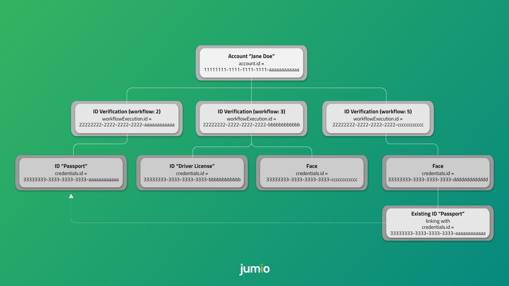

# Web Transition Guide
This document is intended as a reference manual for customers migrating __ID Verification Web__ to the new platform API.

It provides an overview of the significant changes in the new client and describes the adjustments that will be needed to be made to your implementation to use the new platform API.

## Introduction
The Jumio KYX Platform API allows you to manage your user journeys. It allows you to create and update accounts for your users, prompt them to provide data such as a photo ID and selfie, and get identity verification results in real time so you can complete their onboarding.

The KYX Platform API is user-based and highly flexible, allowing various workflows that can be easily combined into a single user journey. Each workflow defines a single transaction executing a series of specific tasks, such as data extraction and a liveness check. Multiple workflows can be executed on the same account.

The following diagram shows several possible workflows:



| ℹ️&nbsp;&nbsp; Some functionalities described in this document might be unavailable, depending on the scope of your license with Jumio. Contact your Jumio Solutions Engineer if you have any questions.
|:----------|

## Table of Contents
- [Authentication and Encryption](#authentication-and-encryption)
  - [Access Token Timeout](#access-token-timeout)
  - [Workflow Transaction Token Timeout](#workflow-transaction-token-timeout)
- [Initiating](#initiating)
  - [Request](#request)
  - [Response](#response)
- [Workflow Descriptions](#workflow-descriptions)
- [Displaying Web Client](#displaying-web-client)
  - [Embedding in an iFrame](#embedding-in-an-iframe)
  - [Using a Native WebView](#using-a-native-webview)
- [After the User Journey](#after-the-user-journey)
- [Callback & Retrieval](#callback--retrieval)
- [Supported Environments](#supported-environments)

# Authentication and Encryption
API calls are protected using either __HTTP Basic Authentication__ or __OAuth2__.

| ⚠️&nbsp;&nbsp; Never share your API token, API secret, or OAuth2 credentials with anyone — not even Jumio Support!
|:----------|

The Account Management Service initiates the acquisition process and returns:

* either a JSON Web Token (JWT), which can be used to authenticate to the Jumio backend system to use with the SDK
* or Redirect-URLs, which can be used to upload documents using the other channels

At the moment, your Basic Auth credentials are constructed using your API token as the User ID and your API secret as the password. You can view and manage your API token and secret in the Customer Portal under:
* __Settings > API credentials > API Users__

## OAuth2
Your new OAuth2 credentials are constructed using your API token as the Client ID and your API secret as the Client secret. You can view and manage your API token and secret in the Customer Portal under:
* __Settings > API credentials > OAuth2 Clients__

Client ID and Client secret are used to generate an OAuth2 access token. OAuth2 has to be activated for your account. Contact your Jumio Account Manager for activation.

### Access Token URL (OAuth2)
* US: `https://auth.amer-1.jumio.ai/oauth2/token`
* EU: `https://auth.emea-1.jumio.ai/oauth2/token`
* SG: `https://auth.apac-1.jumio.ai/oauth2/token`

The [TLS Protocol](https://tools.ietf.org/html/rfc5246) is required to securely transmit your data, and we strongly recommend using the latest version. For information on cipher suites supported by Jumio during the TLS handshake see [supported cipher suites](https://github.com/Jumio/implementation-guides/blob/master/netverify/supported-cipher-suites.md).

| ℹ️&nbsp;&nbsp; Calls with missing, incorrect or suspicious headers or parameter values will result in HTTP status code __400 Bad Request Error__ or __403 Forbidden__
|:----------|

## Examples

### Request Access Token
```
curl --request POST --location 'https://auth.amer-1.jumio.ai/oauth2/token' \
    --header 'Accept: application/json' \
    --header 'Content-Type: application/x-www-form-urlencoded' \
    --data-raw 'grant_type=client_credentials' \
    --basic --user CLIENT_ID:CLIENT_SECRET
```

### Response
```
{
  "access_token": "YOUR_ACCESS_TOKEN",
  "expires_in": 3600,
  "token_type": "Bearer"
}
```

## Access Token Timeout
Your OAuth2 access token is valid for 60 minutes. After the token lifetime is expired, it is necessary to [generate a new access token.](#authentication-and-encryption)

## Workflow (Transaction) Token
The token lifetime is set to 30 minutes per default. It can be configured via the [Jumio Customer Portal](https://github.com/Jumio/implementation-guides/blob/master/netverify/portal-settings.md) and can be overwritten using the API call (`tokenLifetime`). Within this token lifetime the token can be used to initialize the SDK, API or Web journey.

As soon as the workflow (transaction) starts, a 15 minutes session timeout starts. For each action performed (capture image, upload image) the session timeout will reset, and the 15 minutes will start again.

# Initiating
Call the RESTful API with the updated JSON parameters as described below to create a workflow for each user. You will receive a JSON object in the response containing a timestamp, account ID, workflow execution ID (formerly transaction reference), and an URL you can now use to present the client to your users.

## Current architecture
HTTP Request Method: __POST__     
* US: `https://netverify.com/api/v4/initiate`
* EU: `https://lon.netverify.com/api/v4/initiate`
* SG: `https://core-sgp.jumio.com/api/v4/initiate`

## New architecture (to initiate all transactions)

__Account creation__ to create a new account:

HTTP Request Method: __POST__     
* US: `https://account.amer-1.jumio.ai/api/v1/accounts`
* EU: `https://account.emea-1.jumio.ai/api/v1/accounts`
* SG: `https://account.apac-1.jumio.ai/api/v1/accounts`

__Account update__ if the account has been already created (existing account ID):

HTTP Request Method: __PUT__   
* US: `https://account.amer-1.jumio.ai/api/v1/accounts/<accountId>`
* EU: `https://account.emea-1.jumio.ai/api/v1/accounts/<accountId>`
* SG: `https://account.apac-1.jumio.ai/api/v1/accounts/<accountId>`

## Request

### Request Headers
The request headers stay the same besides the preferred Authorization method (Basic Authentication / OAuth2).

The following fields are required in the header section of your request:

`Accept: application/json`   
`Content-Type: application/json`    
`Content-Length:` see [RFC-7230](https://tools.ietf.org/html/rfc7230#section-3.3.2)   
`Authorization:` see [RFC6749](https://tools.ietf.org/html/rfc6749)   
`User-Agent: YourCompany YourApp/v1.0`   

| ⚠️&nbsp;&nbsp; Jumio requires the `User-Agent` value to reflect your business or entity name for API troubleshooting.
|:----------|

| ℹ️&nbsp;&nbsp; Calls with missing or suspicious headers, suspicious parameter values, or without OAuth2 will result in HTTP status code __403 Forbidden__
|:----------|

### Request Body
With this new architecture, we have begun the process of improving consistency across all of our APIs.

Some of the initiate API request fields have been retained, but have new names. We have also deprecated some fields and added a few new ones. Our changes are described below.

#### New Parameters

__Required fields appear in bold type.__

| Parameter                     | Type |  Notes |
|:-------------------------------|:---|:---|
| __workflowDefinition__         |object |Definition of the specific documents necessary to execute for the particular capabilities on them.|
| __workflowDefinition.key__     |object |Key of the workflow definition which you want to execute.<br>See [Workflow Definition Keys](#workflow-definition-keys)|
| workflowDefinition.credentials |array (object) |Optional workflow definition object part to customize acquiring process and workflow process.<br>Possible values: <br>See [workflowDefinition.credentials](#response-workflowdefinitioncredentials)|
| web |object|Web parameters are only relevant for the WEB channel.|

#### Request workflowDefinition.credentials

| Parameter              | Type           | Max. Length          | Notes                                                                     |
|------------------------|----------------|----------------------|---------------------------------------------------------------------------|
| category               | string         |                      | Possible values:<br>• ID<br>• FACEMAP<br>• DOCUMENT<br>•	SELFIE           |
| country                | object         |                      | Possible values:<br>• country.values                                      |
| country.predefinedType | string         |                      | Possible values:<br>• DEFINED (default: end user is not able to change country)<br>• RECOMMENDED (country is preselected, end user is still able to change it) |
| country.values         | array (string) | See possible values. | Define at least one ISO 3166-1 alpha-3 country code for the workflow definition.<br>Possible values: <br>•	[ISO 3166-1 alpha-3 country code](http://en.wikipedia.org/wiki/ISO_3166-1_alpha-3) |
| type                   | object         |                      | Possible values:<br>•	 type.values                                       |
| type.predefinedType    | object         |                      | Possible values:<br>• DEFINED (default: end user is not able to change document type)<br>• RECOMMENDED (type is preselected, end user is still able to change it) |
| type.values            | array (string) | See possible values. | Defined number of credential type codes. <br>Possible values:<br>• ID_CARD<br>• DRIVING_LICENSE<br>• PASSPORT<br>• VISA       |

#### Minor Changed Parameters

__Required fields appear in bold type.__

| Current | New | Type | Max. Length | Changes |
|:---------|:--------|:--------|:--------|:--------|
| successUrl<sup>1</sup> | web.successUrl<sup>2</sup> | string | 255 | Parameter nested in `web` object<br><br>URL to which the browser will send the end-user at the end of a successful web acquisition user journey. |
| errorUrl<sup>1</sup> | web.errorUrl<sup>2</sup> | string | 255 |  Parameter nested in `web` object<br><br>URL to which the browser will send the end-user at the end of a failed web acquisition user journey. |
| locale<sup>1</sup> | web.locale<sup>2</sup> | string | 5 |  Parameter embedded in `web` object <br><br>Renders content in the specified language.<br><br>See [supported locale values](#supported-locale-values).|
| tokenLifetimeInMinutes | tokenLifetime | string | minimum: 5m, maximum: 60d,<br>default: 30m | Parameter has been renamed. Previously defined in minutes. <br><br> Should be a valid date period unit definition:<br>s - seconds<br>m - minutes<br>h - hours<br>d - days<br>Example: '1d' / '30m' / '600s'|
| presets | workflowDefinition.credentials.country.values<br> workflowDefinition.credentials.type.values |array | |Not yet implemented for Web.<br><br>Preset options to enhance the user journey. |

<sup>1</sup> Overrides default setting from the Customer Portal.

##### Supported `locale` values
Parameter `web.locale` can be used to render the content of the client in the specified language.

Hyphenated combination of [ISO 639-1:2002 alpha-2](https://en.wikipedia.org/wiki/ISO_639-1) language code plus [ISO 3166-1 alpha-2](https://en.wikipedia.org/wiki/ISO_3166-1_alpha-2) country (where applicable).

|Value  |Locale|
|:--------------|:--------------|
|ar|Arabic|
|bg|Bulgarian|
|cs|Czech|
|da|Danish|
|de|German|
|el|Greek|
|en|American English (**default**)|
|en-GB|British English|
|es|Spanish|
|es-MX|Mexican Spanish|
|et|Estonian|
|fi|Finnish|
|fr|French|
|he|Hebrew|
|hr|Croatian|
|hu|Hungarian|
|hy|Armenian|
|id|Indonesian|
|it|Italian|
|ja|Japanese|
|ka|Georgian|
|km|Khmer|
|ko|Korean|
|lt|Lithuanian|
|ms|Malay|
|nl|Dutch|
|no|Norwegian|
|pl|Polish|
|pt|Portuguese|
|pt-BR|Brazilian Portuguese|
|ro|Romanian|
|ru|Russian|
|sk|Slovak|
|sv|Swedish|
|th|Thai|
|tr|Turkish|
|vi|Vietnamese|
|zh-CN|Simplified Chinese|
|zh-HK|Traditional Chinese|


#### Retained Parameters

__Required fields appear in bold type.__

| Parameter | Type | Max. Length | Changes |
|:--------|:--------|:--------|:--------|
| __customerInternalReference__<sup>1</sup> | string | 100 | No change <br><br>Customer internal reference for a request to link it in the customer backend|
| userReference<sup>1</sup> | string | 100 | No change<br><br>Reference for the end user in the customer backend  |
| reportingCriteria | string | 255 | No change<br><br>Additional information provided by a customer for searching and aggregation purposes |
| callbackUrl<sup>2</sup> | string | 255 | No change <br><br>Definition of the callback URL for this particular request|

<sup>1</sup> Values __must not__ contain Personally Identifiable Information (PII) or other sensitive data such as email addresses.<br>
<sup>2</sup> Overrides default setting from the Customer Portal.

#### Deprecated Parameters

| Parameter | Notes |
|:------------------|:------|
| workflowId        | This parameters has been removed.<br><br> Verification type can be now defined via __workflowDefinition.key__<br> Capture method can be defined in the Customer Portal |

## Response
Unsuccessful requests will return the relevant HTTP status code and information about the cause of the error.

Successful requests will return HTTP status code __200 OK__ along with a JSON object containing the information described below.

### New Parameters

| Parameter                     | Type | Notes |
|:-------------------------------|:-----|:-----|
| account                        |object|Possible values:<br>• account.id|
| account.id                     |string|UUID of the account|
| sdk                            |object|Possible values:<br>• sdk.token<br><br>*SDK parameters are only relevant for the SDK channel.*|
| sdk.token                      |string|JWT token for performing any action<br><br>*SDK parameters are only relevant for the SDK channel.*|
| workflowExecution              |object|Possible values:<br>• workflowExecution.id<br>• workflowExecution.credentials|
| workflowExecution.credentials  |array (object)|Credential response<br>See [workflowExecution.credentials](#response-workflowdefinition.credentials)|
| web.successUrl  |string|URL to which the browser will send the end-user at the end of a successful web acquisition user journey.|
| web.errorUrl  |string|URL to which the browser will send the end-user at the end of a failed web acquisition user journey.|

#### Response workflowDefinition.credentials
| Parameter             | Type                    | Notes                                                                                                                           |
|-----------------------|-------------------------|-----------------------------------------------------------------------------|
| id                    | string                  | UUID of the credentials                                                                                                         |
| category              | string                  | Credential category.<br>Possible values:<br>• ID<br>•	FACEMAP<br>• DOCUMENT<br>• SELFIE                                         |
| country               | object                  | Defined at least one ISO 3166-1 alpha-3 country code for the workflow definition.<br>Possible values: <br>•	[ISO 3166-1 alpha-3 country code](http://en.wikipedia.org/wiki/ISO_3166-1_alpha-3)                |
| type                  | object                  | Defined number of credential type codes.<br>Possible values: <br>• ID_CARD<br>•	DRIVING LICENSE<br>• PASSPORT<br>• VISA         |
| allowedChannels       | array                   | Channels which can be used to upload particular credential<br>Possible values:<br>• WEB<br>• API<br>•	SDK    |
| api                   | object                  | Available actions for the API calls, actions can be omitted due to unavailability<br>Possible values:<br>• api.token<br>api.parts<br>•	api.workflowExecution <br><br> _API parameters are only relevant for the API channel._ |
| api.token             | string                  | JWT token for performing any action for API<br><br>_API parameters are only relevant for the API channel._                         |
| api.parts             | object                  | href to manage parts for the account credential<br>Possible values:<br>• FRONT<br>•	BACK<br>• FACE <br><br> _API parameters are only relevant for the API channel._                |
| api.workflowExecution | string                  | href to manage the acquisition and workflow processing <br><br>_API parameters are only relevant for the API channel._

### Minor Changed Parameters

| Current     | New   | Type | Changes |
|:-------------|:----------|:-----|:-----|
| timestamp    | timestamp |string |No change.<br>Timestamp (UTC) of the response.<br>Format: YYYY-MM-DDThh:mm:ss.SSSZ|
| redirectUrl  | web.href  |string|Parameter has been renamed.<br>URL used to load the ID Verification client.|
| transactionReference | workflowExecution.id |string|UUID of the workflow|

## Examples

### Request
```
curl --location --request PUT 'https://account.amer-1.jumio.ai/api/v1/accounts/<accountId>' \
--header 'Content-Type: application/json' \
--header 'User-Agent: User Demo' \
--header 'Authorization: Bearer YOUR_ACCESS_TOKEN' \
--data-raw '{
    "customerInternalReference": "CUSTOMER_INTERNAL_REFERENCE",
    "callbackUrl":"https://www.yourcompany.com/callback",
    "workflowDefinition": {
        "key": 2,
        "credentials": [
            {
                "category": "ID",
                "type": {
                    "values": ["DRIVING_LICENSE", "ID_CARD", "PASSPORT"]
                },
                "country": {
                    "values": ["USA", "CAN", "AUT"]
                }
            }
        ]
    },
    "web":{
        "successUrl":"https://www.yourcompany.com/success",
        "errorUrl":"https://www.yourcompany.com/error",
        "locale":"de"
    }

}
```

### Response
```
{
    "timestamp": "2021-06-21T13:14:00.809Z",
    "account": {
        "id": "11111111-1111-1111-1111-aaaaaaaaaaaa"
    },
    "web": {
        "href": "https://mycompany.web.amer-1.jumio.ai/web/v4/app?authorizationToken=xxx&locale=de",
        "successUrl": "https://www.yourcompany.com/success",
        "errorUrl": "https://www.yourcompany.com/error"
    },
    "sdk": {
        "token": "xxx"
    },
    "workflowExecution": {
        "id": "22222222-2222-2222-2222-aaaaaaaaaaaa",
        "credentials": [
            {
                "id": "33333333-3333-3333-aaaaaaaaaaaa",
                "category": "ID",
                "allowedChannels": [
                    "WEB",
                    "API",
                    "SDK"
                ],
                "api": {
                    "token": "eyJhbGciOiJIUzUxMiIsInppcCI6IkdaSVAifQ.H4sIAAAAAAAAAJXLOw4CMQxF0b2kxlLi2IlDR0nLDhJ_SioESIi9MzM7oL3vvE_y9-WRzqk0JJSaKXcp6ZSm6tW2nrGT4BKIiQrEsUCUEXplYhqC4X3nB2Z1NTeHUnkBlYwwrE5YjSTQ2zatDb_C_-F689j0xZ7zrm57Oe69jWGlDlhOAdT6BOlZYFmEBrPYsPT9AdII45riAAAA.f-N7UoaWc_sVkAghkj4im2ipCoizkoa4bvhfmAnoDWjGgY8f9ph_JrLFjHldPmAIxhqh_O4DauOT4zYuYulUlg",
                    "parts": {
                        "front": "https://api.amer-1.jumio.ai/api/v1/accounts/11111111-1111-1111-1111-aaaaaaaaaaaa/workflow-executions/22222222-2222-2222-2222-aaaaaaaaaaaa/credentials/33333333-3333-3333-aaaaaaaaaaaa/parts/FRONT",
                        "back": "https://api.amer-1.jumio.ai/api/v1/accounts/11111111-1111-1111-1111-aaaaaaaaaaaa/workflow-executions/22222222-2222-2222-2222-aaaaaaaaaaaa/credentials/33333333-3333-3333-aaaaaaaaaaaa/parts/BACK"
                    },
                    "workflowExecution": "https://api.amer-1.jumio.ai/api/v1/accounts/11111111-1111-1111-1111-aaaaaaaaaaaa/workflow-executions/22222222-2222-2222-2222-aaaaaaaaaaaa"
                }
            }
        ]
    }
}
```

# Workflow Descriptions

## Workflow Definition Keys
definitionKey | Name                         | Description  |
|---------------|------------------------------|--------------|
| 2             | [ID Verification](workflow_descriptions.md#workflow-2-id-verification)  | Verifies a government-issued ID document and returns a) whether that document is valid, and b) data extracted from that document. |  
| 3             | [ID and Identity Verification](workflow_descriptions.md#workflow-3-id-and-identity-verification) | Verifies a photo ID document and returns a) whether that document is valid, and b) data extracted from that document. It also compares the user's face with the photo on the ID and performs a liveness check to ensure the person is physically present. |
| 5             | [Similarity to existing ID](workflow_descriptions.md#workflow-5-similarity-to-existing-id) | Matches a selfie of a user to the face of a document holder of a stored ID document that has already been verified. |  
| 6             | [Standalone Liveness](workflow_descriptions.md#workflow-6-standalone-liveness) | Captures a user's face to verify that the person is physically present and not presenting a photo or other fake as their selfie. |   
| 9             | [Authentication](workflow_descriptions.md#workflow-9-authentication) | Compares the facemap of a user to an existing facemap that has already been captured. The existing facemap must have been acquired during a previous workflow, e.g. [Workflow 3](workflow_descriptions.md#workflow-3-id-and-identity-verification) or [Workflow 5](workflow_descriptions.md#workflow-5-similarity-to-existing-id). |   
| 16            | [Authentication on Premise](workflow_descriptions.md#workflow-16-authentication-on-premise) | Compares the facemap of a user to an existing facemap that was previously captured and is stored on the customer side. <br><br>  The existing facemap must have been acquired during a previous workflow, e.g. [Workflow 3](#workflow-3-id-and-identity-verification) or [Workflow 5](workflow_descriptions.md#workflow-5-similarity-to-existing-id), and can be retrieved with the [Retrieval API](#retrieval) using the [`validFaceMapForAuthentication`](#capabilitiesliveness) parameter. |
| 20            | [Similarity of Two Images](workflow_descriptions.md#workflow-20-similarity-of-two-images) | Matches the user's selfie with the photo on the ID to verify they are the same person. |
| 32            | [ID Verification, Identity Verification, Screening](workflow_descriptions.md#workflow-32-id-verification-identity-verification-screening) | Verifies a photo ID document and returns a) whether that document is valid, and b) data extracted from that document. It also compares the user's face with the photo on the ID and performs a liveness check to ensure the person is physically present. Checks if user is part of any sanctions list using Comply Advantage. |

Workflows are specified using the `key` attribute in the `workflowDefinition` object:
```
"workflowDefinition": {
    "key": DEFINITION_KEY,
    "credentials": []
}
```

# Displaying Web Client

The `web.href` returned in the response of your create/update account API call, under which the web application runs, should be presented to the end-user for whom the workflow was initiated. This can be used in several ways:

* within an iFrame on your web page
* as a link on your web page that opens a new browser tab or window
* as a link shared securely with an end-user
* in a native webview

## Embedding in an iFrame
No change to embed the generated `web.href` from the new architecture. See the current [ID Verification Implementation Guide](/netverify/netverify-web-v4.md#displaying-id-verification) for further information.

### Width and Height
No change for recommended responsive breaking points. See the current [ID Verification Implementation Guide](/netverify/netverify-web-v4.md#width-and-height) for further information.

### Biometric Face Capture
No change for Biometric Face Capture and Web. See the current [ID Verification Implementation Guide](/netverify/netverify-web-v4.md#3d-liveness) for further information.

| ⚠️&nbsp;&nbsp; The `allow="camera;fullscreen;accelerometer;gyroscope;magnetometer" allowfullscreen` iFrame attributes must be included to enable biometric face capture in supported browsers.
|:----------|

### Optional iFrame logging
Setup and usage of the optional iFrame logging stays the same besides of some changes to a few properties in the `event.data` object listed below. See the current [ID Verification Implementation Guide](/netverify/netverify-web-v4.md#optional-iframe-logging) for further information about Optional iFrame logging.

#### `event.data` object

##### New Parameters

**Required items appear in bold type.**

|New Property|Type|Description
|:-------|:---|:----------|
**accountId**|string|UUID of the account|

##### Minor Changed Parameters

**Required items appear in bold type.**

|Current Property|New Property|Type|Description
|:-------|:-------|:---|:----------|
|**transactionReference** |**workflowExecutionId**|string|Property has been renamed <br><br>UUID of the workflow|

##### Retained Parameters

**Required items appear in bold type.**  

|Property|Type|Description
|:-------|:---|:----------|
|**authorizationToken**|string|Authorization token, valid for a specified duration|
|**customerInternalReference**<sup>1</sup>|string| Internal reference for a request to link it in the customer backend (must not contain any PII |
|**eventType**|integer|Type of event that has occurred.<br>Possible values: <br>• `510` (application state-change)|
|**dateTime**|string|UTC timestamp of the event in the browser<br>Format: *YYYY-MM-DDThh:mm:ss.SSSZ*|
|**payload**|JSON object|Information specific to the event generated <br>(see [`event.data.payload` object](#eventdatapayload-object))|

<sup>1</sup> Values **must not** contain Personally Identifiable Information (PII) or other sensitive data such as email addresses.

#### `event.data.payload` object

No change for the `event.data.payload` object.

#### `event.data.payload.metainfo` object

No change for the `event.data.payload.metainfo` object.

#### Example iFrame logging code
~~~javascript
function receiveMessage(event) {
	var data = window.JSON.parse(event.data);
  console.log('ID Verification Web was loaded in an iframe.');
  console.log('auth-token:', data.authorizationToken);
  console.log('event-type:', data.eventType);
  console.log('date-time:', data.dateTime);
  console.log('workflow-execution-id:', data.workflowExecutionId);
  console.log('account-id:', data.accountId);
  console.log('customer-internal-reference:', data.customerInternalReference);
  console.log('value:', data.payload.value);
  console.log('metainfo:', data.payload.metainfo);
}
window.addEventListener("message", receiveMessage, false);
~~~

## Using a Native WebView
No change for embedding Web within a WebView in your native mobile application. See the current [ID Verification Implementation Guide](/netverify/netverify-web-v4.md#using-id-verification-in-a-native-webview) for further information.

## After the User Journey

At the end of the web acquisition user journey the following query parameters are appended by the web client to the success or error URL before the end-user is redirected by the browser.

### New Parameters

**Required items appear in bold type.**

|Name|Description|
|:---|:---|
|**accountId**| UUID of the account |

### Minor Changed Parameters

**Required items appear in bold type.**

|Current|New|Description|
|:---|:---|:---|
|**transactionReference**|**workflowExecutionId**| UUID of the workflow |
|**transactionStatus**|**acquisitionStatus**|Possible values:<br>• `SUCCESS`<br> • `ERROR` |

### Retained Parameters

**Required items appear in bold type.**

|Name|Description|
|:---|:---|
|**customerInternalReference**|Customer internal reference for a request to link it in the customer backend |
|errorCode|Predefined list of error codes, only appended to `errorUrl` when `acquisitionStatus` is `ERROR`<br>Possible values: <br>• `9100` (Error occurred on our server.)<br>• `9200` (Authorization token missing, invalid, or expired.)<br>• `9210` (Session expired after the user journey started.)<br>• `9300` (Error occurred transmitting image to our server.)<br>• `9400` (Error occurred during verification step.)<br>• `9800` (User has no network connection.)<br>• `9801` (Unexpected error occurred in the client.)<br>• `9810` (Problem while communicating with our server.)<br>• `9820` (File upload not enabled and camera unavailable.)<br>• `9821` (The biometric face capture process failed, e.g. issue with iProov)<br>• `9822` (Browser does not support camera.)<br>• `9835` (No acceptable submission in 3 attempts.) |

# Callback & Retrieval
To get information about callbacks, Retrieval API, Delete API, and more, please refer to our page with [server related information](api_guide.md#callback).

A result overview page can be found in the Customer Portal under "Workflows".

## Supported Environments
No change for supported environments. See the current [ID Verification Implementation Guide](/netverify/netverify-web-v4.md#supported-environments) for further information.

---
&copy; Jumio Corporation, 395 Page Mill Road, Suite 150 Palo Alto, CA 94306
