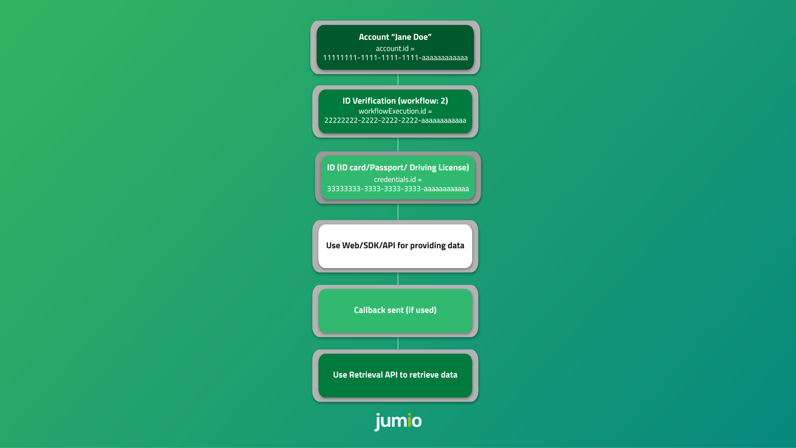
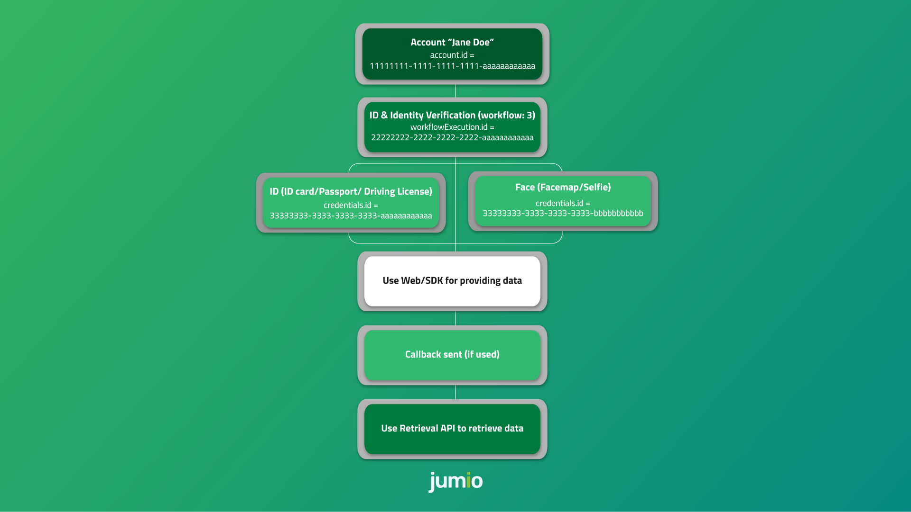
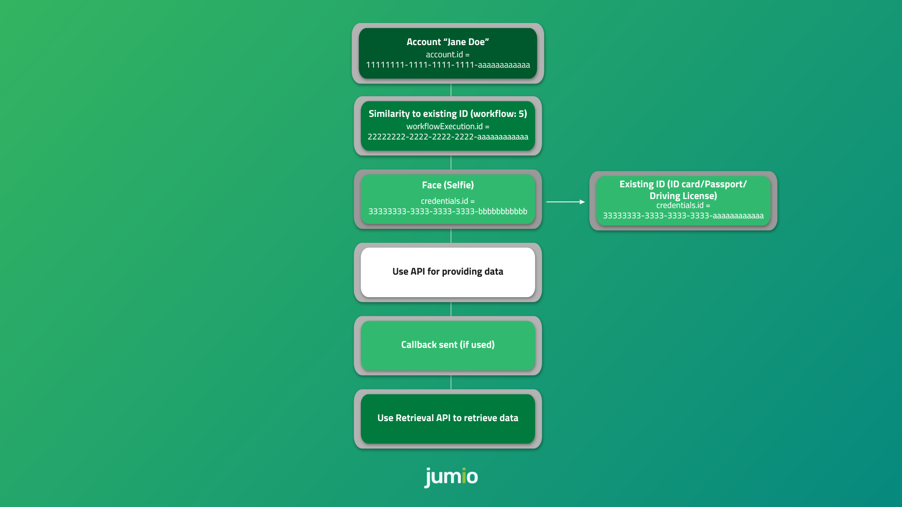
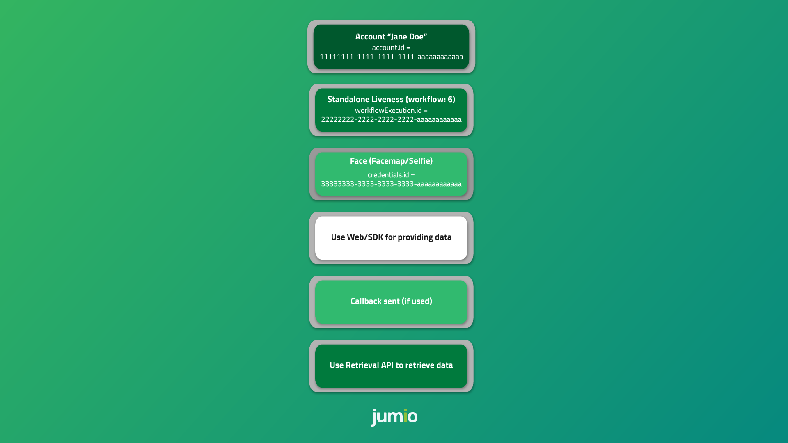
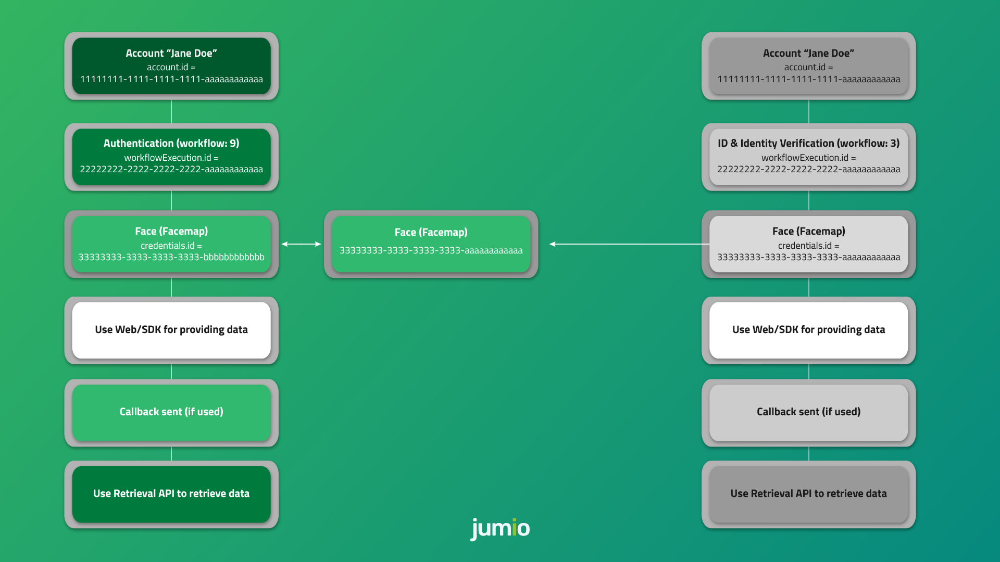
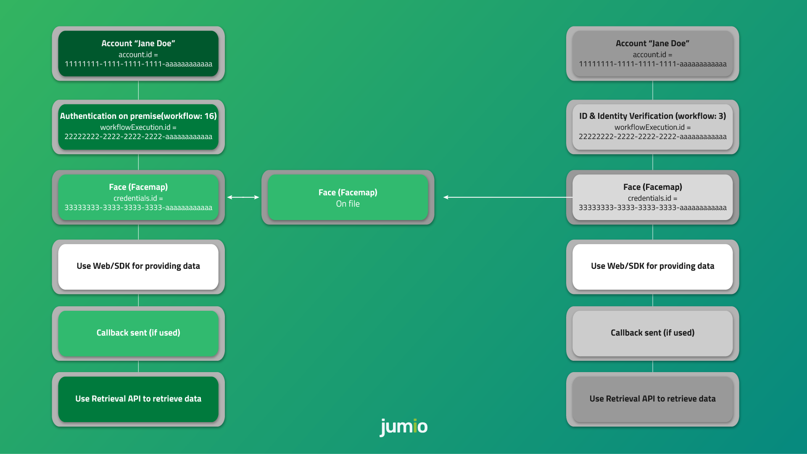
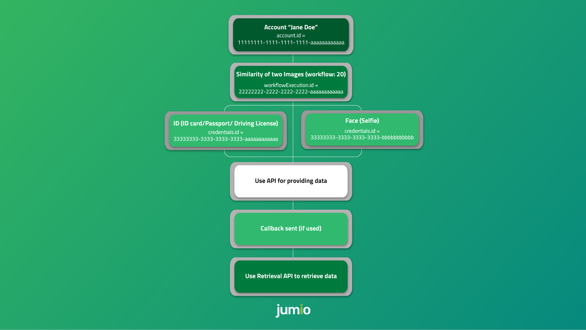
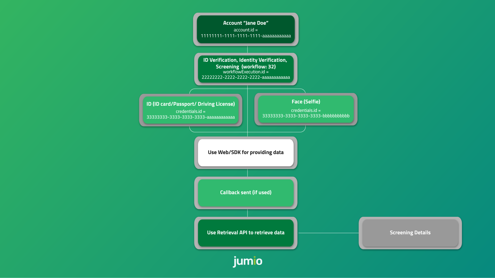

# Workflow Descriptions

## Table of Contents
- [Workflow 2: ID Verification](#workflow-2-id-verification)
- [Workflow 3: ID and Identity Verification](#workflow-3-id-and-identity-verification)
- [Workflow 5: Similarity to existing ID](#workflow-5-similarity-to-existing-id)
- [Workflow 6: Standalone Liveness](#workflow-6-standalone-liveness)
- [Workflow 9: Authentication](#workflow-9-authentication)
- [Workflow 16: Authentication on Premise](#workflow-16-authentication-on-premise)
- [Workflow 20: Similarity of Two Images](#workflow-20-similarity-of-two-images)
- [Workflow 32: ID Verification, Identity Verification, Screening](#workflow-32-id-verification-identity-verification-screening)
- [Retrieval](#retrieval-2)

Workflows are specified using the `key` attribute in the `workflowDefinition` object:
```
"workflowDefinition": {
    "key": DEFINITION_KEY,
    "credentials": []
}
```

## Workflow 2: ID Verification
This workflow verifies a government-issued ID document and returns a) whether that document is valid, and b) data extracted from that document.



__Workflow 2: Details__


### Required Credentials
* ID

### Stored Credentials
* ID

### Prerequisites
* Allowed channels: API, SDK, WEB

### Capabilities
In order of dependency:
* [usability](api_guide.md#capabilitiesusability) --> [imageChecks](api_guide.md#capabilitiesimagechecks) --> [extraction](api_guide.md#capabilitiesextraction) --> [dataChecks](api_guide.md#capabilitiesdatachecks)

### Example

#### Initiate Account Creation

HTTP Request Method: __POST__
* US: `https://account.amer-1.jumio.ai/api/v1/accounts`
* EU: `https://account.emea-1.jumio.ai/api/v1/accounts`
* SG: `https://account.apac-1.jumio.ai/api/v1/accounts`

__Request:__
```
curl --request POST --location 'https://account.amer-1.jumio.ai/api/v1/accounts' \
    --header 'Content-Type: application/json' \
    --header 'User-Agent: User Demo' \
    --header 'Authorization: Bearer
    YOUR_ACCESS_TOKEN' \
    --data-raw '{
        "customerInternalReference": "CUSTOMER_REFERENCE",
        "workflowDefinition": {
            "key": 2,
            "credentials": [
                {
                    "category": "ID",
                    "type": {
                        "values": ["DRIVING_LICENSE", "ID_CARD", "PASSPORT"]
                    },
                    "country": {
                        "values": ["USA", "CAN", "AUT", "GBR"]
                    }
                }
            ]
        },
        "callbackUrl": "YOUR_CALLBACK_URL",
        "userReference": "YOUR_USER_REFERENCE",
    }'
```

__Response:__
```
{
    "timestamp": "2021-05-28T09:17:50.240Z",
    "account": {
        "id": "11111111-1111-1111-1111-aaaaaaaaaaaa"
    },
    "web": {
        "href": "https://mycompany.web.amer-1.jumio.ai/web/v4/app?authorizationTokenxxx&locale=es"
    },
    "sdk": {
        "token": "xxx"
    },
    "workflowExecution": {
        "id": "22222222-2222-2222-2222-aaaaaaaaaaaa",
        "credentials": [
            {
                "id": "33333333-3333-3333-aaaaaaaaaaaa",
                "category": "ID",
                "allowedChannels": [
                    "WEB",
                    "API",
                    "SDK"
                ],
                "api": {
                    "token": "xxx",
                    "parts": {
                        "front": "https://api.amer-1.jumio.ai/api/v1/accounts/11111111-1111-1111-1111-aaaaaaaaaaaa/workflow-executions/22222222-2222-2222-2222-aaaaaaaaaaaa/credentials/33333333-3333-3333-aaaaaaaaaaaa/parts/FRONT",
                        "back": "https://api.amer-1.jumio.ai/api/v1/accounts/11111111-1111-1111-1111-aaaaaaaaaaaa/workflow-executions/22222222-2222-2222-2222-aaaaaaaaaaaa/credentials/33333333-3333-3333-aaaaaaaaaaaa/parts/BACK"
                    },
                    "workflowExecution": "https://api.amer-1.jumio.ai/api/v1/accounts/11111111-1111-1111-1111-aaaaaaaaaaaa/workflow-executions/22222222-2222-2222-2222-aaaaaaaaaaaa"
                }
            }
        ]
    }
}
```

#### Initiate Account Update

HTTP Request Method: __PUT__
* US: `https://account.amer-1.jumio.ai/api/v1/accounts/<accountId>`
* EU: `https://account.emea-1.jumio.ai/api/v1/accounts/<accountId>`
* SG: `https://account.apac-1.jumio.ai/api/v1/accounts/<accountId>`

__Request:__
```
curl --request POST --location 'https://account.amer-1.jumio.ai/api/v1/accounts/11111111-1111-1111-1111-aaaaaaaaaaaa' \
    --header 'Content-Type: application/json' \
    --header 'User-Agent: User Demo' \
    --header 'Authorization: Bearer
    YOUR_ACCESS_TOKEN' \
    --data-raw '{
        "customerInternalReference": "CUSTOMER_REFERENCE",
        "workflowDefinition": {
            "key": 2,
            "credentials": [
                {
                    "category": "ID",
                    "type": {
                        "values": ["DRIVING_LICENSE", "ID_CARD", "PASSPORT"]
                    },
                    "country": {
                        "values": ["USA", "CAN", "AUT", "GBR"]
                    }
                }
            ]
        },
        "callbackUrl": "YOUR_CALLBACK_URL",
        "userReference": "YOUR_USER_REFERENCE",
    }'
```

__Response:__
```
{
    "timestamp": "2021-02-16T16:03:10.466Z",
    "account": {
        "id": "11111111-1111-1111-1111-aaaaaaaaaaaa"
    },
    "web": {
        "href": "https://mycompany.web.amer-1.jumio.ai/web/v4/app?authorizationToken=xxx&locale=de"
    },
    "sdk": {
        "token": "xxx"
    },
    "workflowExecution": {
        "id": "22222222-2222-2222-2222-aaaaaaaaaaaa",
        "credentials": [
            {
                "id": "33333333-3333-3333-3333-aaaaaaaaaaaa",
                "category": "ID",
                "allowedChannels": [
                    "WEB",
                    "API",
                    "SDK"
                ],
                "api": {
                    "token": "xxx",
                    "parts": {
                        "front": "https://api.apac-1.jumio.ai/api/v1/accounts/11111111-1111-1111-1111-aaaaaaaaaaaa/workflow-executions/22222222-2222-2222-2222-aaaaaaaaaaaa/credentials/33333333-3333-3333-3333-aaaaaaaaaaaa/parts/FRONT",
                        "back": "https://api.apac-1.jumio.ai/api/v1/accounts/11111111-1111-1111-1111-aaaaaaaaaaaa/workflow-executions/22222222-2222-2222-2222-aaaaaaaaaaaa/credentials/33333333-3333-3333-3333-aaaaaaaaaaaa/parts/BACK"
                    },
                    "workflowExecution": "https://api.apac-1.jumio.ai/api/v1/accounts/11111111-1111-1111-1111-aaaaaaaaaaaa/workflow-executions/22222222-2222-2222-2222-aaaaaaaaaaaa"
                }
            }
        ]
    }
}
```

Please also refer to [Account Update section.](api_guide.md#examples)

## Workflow 3: ID and Identity Verification
This workflow verifies a photo ID document and returns a) whether that document is valid, and b) data extracted from that document. It also compares the user's face with the photo on the ID and performs a liveness check to ensure the person is physically present.



### Required Credentials
* ID
* Selfie
* Facemap

### Stored Credentials
* ID
* Selfie
* Facemap

### Prerequisites
* Identity Verification must be enabled for your account. (Contact your Jumio account manager for activation.)
* Allowed channels: SDK, WEB

### Capabilities
In order of dependency:
* [usability](api_guide.md#capabilitiesusability) --> [imageChecks](api_guide.md#capabilitiesimagechecks) --> [extraction](api_guide.md#capabilitiesextraction) --> [dataChecks](api_guide.md#capabilitiesdatachecks)
* [usability](api_guide.md#capabilitiesusability) --> [liveness](api_guide.md#capabilitiesliveness)

### Example

#### Initiate Account Creation

HTTP Request Method: __POST__
* US: `https://account.amer-1.jumio.ai/api/v1/accounts`
* EU: `https://account.emea-1.jumio.ai/api/v1/accounts`
* SG: `https://account.apac-1.jumio.ai/api/v1/accounts`

__Request:__
```
curl --request POST --location 'https://account.amer-1.jumio.ai/api/v1/accounts' \
    --header 'Content-Type: application/json' \
    --header 'User-Agent: User Demo' \
    --header 'Authorization: Bearer
    YOUR_ACCESS_TOKEN' \
    --data-raw '{
        "customerInternalReference": "CUSTOMER_REFERENCE",
        "workflowDefinition": {
            "key": 3,
            "credentials": [
                {
                    "category": "ID",
                    "type": {
                        "values": ["DRIVING_LICENSE", "ID_CARD", "PASSPORT"]
                    },
                    "country": {
                        "values": ["USA", "CAN", "AUT", "GBR"]
                    }
                }
            ]
        },
        "callbackUrl": "YOUR_CALLBACK_URL",
        "userReference": "YOUR_USER_REFERENCE",
    }'
```

__Response:__
```
{
    "timestamp": "2021-05-19T14:55:08.187Z",
    "account": {
        "id": "11111111-1111-1111-1111-aaaaaaaaaaaa"
    },
    "web": {
        "href": "https://mycompany.web.amer-1.jumio.ai/web/v4/app?authorizationToken=xxx&locale=es"
    },
    "sdk": {
        "token": "xxx"
    },
    "workflowExecution": {
        "id": "22222222-2222-2222-2222-aaaaaaaaaaaa",
        "credentials": [
            {
                "id": "33333333-3333-3333-aaaaaaaaaaaa",
                "category": "ID",
                "allowedChannels": [
                    "WEB",
                    "SDK"
                ]
            },
            {
                "id": "33333333-3333-3333-bbbbbbbbbbbb",
                "category": "FACEMAP",
                "allowedChannels": [
                    "WEB",
                    "SDK"
                ]
            },
            {
                "id": "33333333-3333-3333-cccccccccccc",
                "category": "SELFIE",
                "allowedChannels": [
                    "WEB",
                    "SDK"
                ]
            }
        ]
    }
}
```

#### Initiate Account Update

HTTP Request Method: __PUT__
* US: `https://account.amer-1.jumio.ai/api/v1/accounts/<accountId>`
* EU: `https://account.emea-1.jumio.ai/api/v1/accounts/<accountId>`
* SG: `https://account.apac-1.jumio.ai/api/v1/accounts/<accountId>`

__Request:__
```
curl --request POST --location 'https://account.amer-1.jumio.ai/api/v1/accounts/11111111-1111-1111-1111-aaaaaaaaaaaa' \
    --header 'Content-Type: application/json' \
    --header 'User-Agent: User Demo' \
    --header 'Authorization: Bearer
    YOUR_ACCESS_TOKEN' \
    --data-raw '{
        "customerInternalReference": "CUSTOMER_REFERENCE",
        "workflowDefinition": {
            "key": 3,
            "credentials": [
                {
                    "category": "ID",
                    "type": {
                        "values": ["DRIVING_LICENSE", "ID_CARD", "PASSPORT"]
                    },
                    "country": {
                        "values": ["USA", "CAN", "AUT", "GBR"]
                    }
                }
            ]
        },
        "callbackUrl": "YOUR_CALLBACK_URL",
        "userReference": "YOUR_USER_REFERENCE",
    }'
```

__Response:__
```
{
    "timestamp": "2021-05-19T14:55:08.187Z",
    "account": {
        "id": "11111111-1111-1111-1111-aaaaaaaaaaaa"
    },
    "web": {
        "href": "https://mycompany.web.amer-1.jumio.ai/web/v4/app?authorizationToken=xxx&locale=es"
    },
    "sdk": {
        "token": "xxx"
    },
    "workflowExecution": {
        "id": "22222222-2222-2222-2222-aaaaaaaaaaaa",
        "credentials": [
            {
                "id": "33333333-3333-3333-aaaaaaaaaaaa",
                "category": "ID",
                "allowedChannels": [
                    "WEB",
                    "SDK"
                ]
            },
            {
                "id": "33333333-3333-3333-bbbbbbbbbbbb",
                "category": "FACEMAP",
                "allowedChannels": [
                    "WEB",
                    "SDK"
                ]
            },
            {
                "id": "33333333-3333-3333-cccccccccccc",
                "category": "SELFIE",
                "allowedChannels": [
                    "WEB",
                    "SDK"
                ]
            }
        ]
    }
}
```

## Workflow 5: Similarity to Existing ID
This workflow matches a selfie of a user to the face of a document holder of a stored ID document that has already been verified.



### Required Credentials
* ID (already on file)
* Selfie

### Stored Credentials
* ID
* Selfie

### Prerequisites
* ID already on file (workflowExecution.credentials.id)
* Identity Verification must be enabled for your account. (Contact your Jumio account manager for activation.)
* Account already exists, `<accountId>` available
* Allowed channels: API

### Capabilities
In order of dependency:
* [usability](api_guide.md#capabilitiesusability) --> [similarity](api_guide.md#capabilitiessimilarity)

### Example

#### Initiate Account Update

HTTP Request Method: __PUT__
* US: `https://account.amer-1.jumio.ai/api/v1/accounts/<accountId>`
* EU: `https://account.emea-1.jumio.ai/api/v1/accounts/<accountId>`
* SG: `https://account.apac-1.jumio.ai/api/v1/accounts/<accountId>`

__Request:__
```
curl --location --request PUT 'https://account.amer-1.jumio.ai/api/v1/accounts/11111111-1111-1111-1111-aaaaaaaaaaaa' \
--header 'Content-Type: application/json' \
--header 'User-Agent: User Demo' \
--header 'Authorization: Bearer xxx' \
--data-raw '{
    "customerInternalReference": "123",
    "workflowDefinition": {
        "key": 5,
        "credentials": [
            {
                "id": "33333333-3333-3333-aaaaaaaaaaaa",
                "category": "ID"
            },
            {
                "category": "SELFIE"
            }
        ]
    }
}'
```

__Response:__
```
{
	"timestamp":"2021-05-14T13:58:13.285Z",
	"account":{
		"id":"11111111-1111-1111-1111-aaaaaaaaaaaa"
	},
	"workflowExecution":{
		"id":"22222222-2222-2222-2222-aaaaaaaaaaaa",
		"credentials":[
			{
				"id":"33333333-3333-3333-aaaaaaaaaaaa",
				"category":"ID",
				"allowedChannels":[]
			},
			{
			"id":"33333333-3333-3333-bbbbbbbbbbbb",
			"category":"SELFIE",
			"allowedChannels":["API"],
			"api":
				{
					"token":"xxx",
					"parts":
						{
							"face":"https://api.amer-1.jumio.ai/api/v1/accounts/11111111-1111-1111-1111-aaaaaaaaaaaa/workflow-executions/22222222-2222-2222-2222-aaaaaaaaaaaa/credentials/33333333-3333-3333-bbbbbbbbbbbb/parts/FACE"
						},
					"workflowExecution":"https://api.amer-1.jumio.ai/api/v1/accounts/11111111-1111-1111-1111-aaaaaaaaaaaa/workflow-executions/22222222-2222-2222-2222-aaaaaaaaaaaa"
				}
			}
		]
	}
}
```

#### Upload Face

HTTP Request Method: __POST__
* US: `https://api.amer-1.jumio.ai/api/v1/accounts/<accountId>/workflow-executions/<workflowExecutionId>/credentials/<credentialsId>/parts/FACE`
* EU: `https://api.emea-1.jumio.ai/api/v1/accounts/<accountId>/workflow-executions/<workflowExecutionId>/credentials/<credentialsId>/parts/FACE`
* SG: `https://api.apac-1.jumio.ai/api/v1/accounts/<accountId>/workflow-executions/<workflowExecutionId>/credentials/<credentialsId>/parts/FACE`

__Request Path Parameters:__

| Parameter           | Type   | Note                                      |
|---------------------|--------|-------------------------------------------|
| accountId           | string | UUID of the account                       |
| workflowExecutionId | string | UUID of the workflow                      |
| credentialsId       | string | UUID of the credentials                   |

__Request Body:__

| Key  | Value                                                          |
|------|----------------------------------------------------------------|
| file | JPEG, PNG  (max. size 10 MB and max resolution of 8000 x 8000) |

__Request:__
```
curl --location --request POST 'https://api.amer-1.jumio.ai/api/v1/accounts/11111111-1111-1111-1111-aaaaaaaaaaaa/workflow-executions/22222222-2222-2222-2222-aaaaaaaaaaaa/credentials/33333333-3333-3333-bbbbbbbbbbbb/parts/FACE' \
--header 'User-Agent: User Demo' \
--header 'Content-Type: multipart/form-data' \
--header 'Authorization: Bearer xxx' \
--form 'file=@"/J:/User/2020-03-01/faces/selfie.jpg"'
```

__Response:__
```
{
    "timestamp": "2021-05-14T14:09:57.266Z",
    "account": {
        "id": "11111111-1111-1111-1111-aaaaaaaaaaaa"
    },
    "workflowExecution": {
        "id": "22222222-2222-2222-2222-aaaaaaaaaaaa"
    },
    "api": {
        "token": "xxx",
        "parts": {
            "face": "https://api.amer-1.jumio.ai/api/v1/accounts/11111111-1111-1111-1111-aaaaaaaaaaaa/workflow-executions/22222222-2222-2222-2222-aaaaaaaaaaaa/credentials/33333333-3333-3333-bbbbbbbbbbbb/parts/FACE"
        },
        "workflowExecution": "https://api.amer-1.jumio.ai/api/v1/accounts/11111111-1111-1111-1111-aaaaaaaaaaaa/workflow-executions/22222222-2222-2222-2222-aaaaaaaaaaaa"
    }
}
```

#### Finalize

HTTP Request Method: __PUT__
* US: `https://api.amer-1.jumio.ai/api/v1/accounts/<accountId>/workflow-executions/<workflowExecutionId>`
* EU: `https://api.emea-1.jumio.ai/api/v1/accounts/<accountId>/workflow-executions/<workflowExecutionId>`
* SG: `https://api.apac-1.jumio.ai/api/v1/accounts/<accountId>/workflow-executions/<workflowExecutionId>`

__Request:__
```
curl --location --request PUT 'https://api.amer-1.jumio.ai/api/v1/accounts/11111111-1111-1111-1111-aaaaaaaaaaaa/workflow-executions/22222222-2222-2222-2222-aaaaaaaaaaaa' \
--header 'User-Agent: User Demo' \
--header 'Content-Type: application/json' \
--header 'Authorization: Bearer xxx'
```

__Response:__
```
{
    "timestamp": "2021-05-14T14:12:30.562Z",
    "account": {
        "id": "11111111-1111-1111-1111-aaaaaaaaaaaa"
    },
    "workflowExecution": {
        "id": "22222222-2222-2222-2222-aaaaaaaaaaaa"
    }
}
```

#### Retrieval
Please refer to [Available Retrieval APIs](#available-retrieval-apis).

## Workflow 6: Standalone Liveness
This workflow captures a user's face to verify that the person is physically present and not presenting a photo or other fake as their selfie.



### Required Credentials
* Selfie
* Facemap

### Stored Credentials
* Selfie
* Facemap

### Prerequisites
* Identity Verification must be enabled for your account. (Contact your Jumio account manager for activation.)
* Allowed channels: SDK, WEB

### Capabilities
In order of dependency:
* [usability](api_guide.md#capabilitiesusability) --> [liveness](api_guide.md#capabilitiesliveness)

### Example

#### Initiate Account Creation

HTTP Request Method: __POST__
* US: `https://account.amer-1.jumio.ai/api/v1/accounts`
* EU: `https://account.emea-1.jumio.ai/api/v1/accounts`
* SG: `https://account.apac-1.jumio.ai/api/v1/accounts`

__Request:__
```
curl --location --request PUT 'https://account.amer-1.jumio.ai/api/v1/accounts' \
--header 'Content-Type: application/json' \
--header 'User-Agent: User Demo' \
--header 'Authorization: Bearer xxx' \
--data-raw '{
    "customerInternalReference": "CUSTOMER_REFERENCE",
    "workflowDefinition": {
        "key": 6,
        "credentials": []
    }
}'
```

__Response:__
```
{
    "timestamp": "2021-05-19T15:11:18.072Z",
    "account": {
        "id": "11111111-1111-1111-1111-aaaaaaaaaaaa"
    },
    "web": {
        "href": "https://mycompany.web.amer-1.jumio.ai/web/v4/app?authorizationToken=xxx&locale=es"
    },
    "sdk": {
        "token": "xxx"
    },
    "workflowExecution": {
        "id": "22222222-2222-2222-2222-aaaaaaaaaaaa",
        "credentials": [
            {
                "id": "33333333-3333-3333-aaaaaaaaaaaa",
                "category": "FACEMAP",
                "allowedChannels": [
                    "WEB",
                    "SDK"
                ]
            },
            {
                "id": "33333333-3333-3333-bbbbbbbbbbbb",
                "category": "SELFIE",
                "allowedChannels": [
                    "WEB",
                    "SDK"
                ]
            }
        ]
    }
}
```

#### Initiate Account Update

HTTP Request Method: __PUT__
* US: `https://account.amer-1.jumio.ai/api/v1/accounts/<accountId>`
* EU: `https://account.emea-1.jumio.ai/api/v1/accounts/<accountId>`
* SG: `https://account.apac-1.jumio.ai/api/v1/accounts/<accountId>`

__Request:__
```
curl --location --request PUT 'https://account.amer-1.jumio.ai/api/v1/accounts/11111111-1111-1111-1111-aaaaaaaaaaaa' \
--header 'Content-Type: application/json' \
--header 'User-Agent: User Demo' \
--header 'Authorization: Bearer xxx' \
--data-raw '{
    "customerInternalReference": "CUSTOMER_REFERENCE",
    "workflowDefinition": {
        "key": 6,
        "credentials": []
    }
}'
```

__Response:__
```
{
    "timestamp": "2021-05-19T15:11:18.072Z",
    "account": {
        "id": "11111111-1111-1111-1111-aaaaaaaaaaaa"
    },
    "web": {
        "href": "https://mycompany.web.amer-1.jumio.ai/web/v4/app?authorizationToken=xxx&locale=es"
    },
    "sdk": {
        "token": "xxx"
    },
    "workflowExecution": {
        "id": "22222222-2222-2222-2222-aaaaaaaaaaaa",
        "credentials": [
            {
                "id": "33333333-3333-3333-aaaaaaaaaaaa",
                "category": "FACEMAP",
                "allowedChannels": [
                    "WEB",
                    "SDK"
                ]
            },
            {
                "id": "33333333-3333-3333-bbbbbbbbbbbb",
                "category": "SELFIE",
                "allowedChannels": [
                    "WEB",
                    "SDK"
                ]
            }
        ]
    }
}
```

## Workflow 9: Authentication
This workflow compares the facemap of a user to an already existing facemap that has already been captured.

The existing facemap must have been acquired during a previous workflow, e.g. [Workflow 3](#workflow-3-id-and-identity-verification) or [Workflow 6](#workflow-6-standalone-liveness).



### Required Credentials
* Selfie
* Facemap

### Stored Credentials
* Selfie
* Facemap

### Prerequisites
* Identity Verification must be enabled for your account. (Contact your Jumio account manager for activation.)
* Account already exists, `<accountId>` available
* Facemap already on file, acquired through previous workflow
* Allowed channels: SDK, WEB

### Capabilities
(In order of dependency)
* [usability](api_guide.md#capabilitiesusability) --> [authentication](api_guide.md#capabilitiesauthentication)

### Example

#### Initiate Account Update

HTTP Request Method: __PUT__
* US: `https://account.amer-1.jumio.ai/api/v1/accounts/<accountId>`
* EU: `https://account.emea-1.jumio.ai/api/v1/accounts/<accountId>`
* SG: `https://account.apac-1.jumio.ai/api/v1/accounts/<accountId>`

__Request:__
```
curl --location --request PUT 'https://account.amer-1.jumio.ai/api/v1/accounts/11111111-1111-1111-1111-aaaaaaaaaaaa' \
--header 'Content-Type: application/json' \
--header 'User-Agent: User Demo' \
--header 'Authorization: Bearer xxx' \
--data-raw '{
    "customerInternalReference": "CUSTOMER_REFERENCE",
    "workflowDefinition": {
        "key": 9,
        "credentials": [
            {
                "id": "33333333-3333-3333-aaaaaaaaaaaa",
                "category": "ID"
            },
            {
                "category": "FACEMAP"
            }
        ]
    }
}'
```

__Response:__
```
{
    "timestamp": "2021-05-19T15:28:15.711Z",
    "account": {
        "id": "11111111-1111-1111-1111-aaaaaaaaaaaa"
    },
    "web": {
        "href": "https://mycompany.web.amer-1.jumio.ai/web/v4/app?authorizationToken=xxx&locale=es"
    },
    "sdk": {
        "token": "xxx"
    },
    "workflowExecution": {
        "id": "22222222-2222-2222-2222-aaaaaaaaaaaa",
        "credentials": [
            {
                "id": "33333333-3333-3333-bbbbbbbbbbbb",
                "category": "FACEMAP",
                "allowedChannels": [
                    "WEB",
                    "SDK"
                ]
            },
            {
                "id": "33333333-3333-3333-cccccccccccc",
                "category": "SELFIE",
                "allowedChannels": [
                    "WEB",
                    "SDK"
                ]
            }
        ]
    }
}
```

## Workflow 16: Authentication on Premise
This workflow compares the facemap of a user to an existing facemap that was previously captured and is stored on the customer side.

The existing facemap must have been acquired during a previous workflow, e.g. [Workflow 3](#workflow-3-id-and-identity-verification) or [Workflow 6](#workflow-6-standalone-liveness), and can be retrieved with the [Retrieval API](#workflow-details) using the [`validFaceMapForAuthentication`](#capabilitiesliveness) parameter.



### Required Credentials
* Selfie
* Facemap

### Stored Credentials
* Selfie
* Facemap

### Prerequisites
* Identity Verification must be enabled for your account. (Contact your Jumio account manager for activation.)
* Facemap on premise must be enabled for your account.
* Account already exists, `<accountId>` available
* Facemap already on file (customer-side), acquired through previous workflow.
* Allowed channels: SDK, WEB

### Capabilities
In order of dependency:
* [usability](api_guide.md#capabilitiesusability) --> [authentication](api_guide.md#capabilitiesauthentication)

### Example

#### Initiate Account Update

HTTP Request Method: __PUT__
* US: `https://account.amer-1.jumio.ai/api/v1/accounts/<accountId>`
* EU: `https://account.emea-1.jumio.ai/api/v1/accounts/<accountId>`
* SG: `https://account.apac-1.jumio.ai/api/v1/accounts/<accountId>`

__Request:__
```
curl --location --request PUT 'https://account.amer-1.jumio.ai/api/v1/accounts/11111111-1111-1111-1111-aaaaaaaaaaaa' \
--header 'Content-Type: application/json' \
--header 'User-Agent: User Demo' \
--header 'Authorization: Bearer xxx' \
--data-raw '{
    "customerInternalReference": "CUSTOMER_REFERENCE",
    "workflowDefinition": {
        "key": 16
    }
}'
```

__Response:__
```
{
    "timestamp": "2021-05-19T15:34:30.408Z",
    "account": {
        "id": "11111111-1111-1111-1111-aaaaaaaaaaaa"
    },
    "web": {
        "href": "https://mycompany.web.amer-1.jumio.ai/web/v4/app?authorizationToken=xxx&locale=es"
    },
    "sdk": {
        "token": "xxx"
    },
    "workflowExecution": {
        "id": "22222222-2222-2222-2222-aaaaaaaaaaaa",
        "credentials": [
            {
                "id": "33333333-3333-3333-aaaaaaaaaaaa",
                "category": "FACEMAP",
                "allowedChannels": [
                    "API"
                ],
                "api": {
                    "token": "xxx",
                    "parts": {
                        "facemap": "https://api.amer-1.jumio.ai/api/v1/accounts/11111111-1111-1111-1111-aaaaaaaaaaaa/workflow-executions/22222222-2222-2222-2222-aaaaaaaaaaaa/credentials/33333333-3333-3333-aaaaaaaaaaaa/parts/FACEMAP"
                    },
                    "workflowExecution": "https://api.amer-1.jumio.ai/api/v1/accounts/11111111-1111-1111-1111-aaaaaaaaaaaa/workflow-executions/22222222-2222-2222-2222-aaaaaaaaaaaa"
                }
            },
            {
                "id": "33333333-3333-3333-bbbbbbbbbbbb",
                "category": "FACEMAP",
                "allowedChannels": [
                    "WEB",
                    "SDK"
                ]
            },
            {
                "id": "33333333-3333-3333-cccccccccccc",
                "category": "SELFIE",
                "allowedChannels": [
                    "WEB",
                    "SDK"
                ]
            }
        ]
    }
}
```

#### Upload Facemap

HTTP Request Method: __POST__
* US: `https://api.amer-1.jumio.ai/api/v1/accounts/<accountId>/workflow-executions/<workflowExecutionId>/credentials/<credentialsId>/parts/FACEMAP`
* EU: `https://api.emea-1.jumio.ai/api/v1/accounts/<accountId>/workflow-executions/<workflowExecutionId>/credentials/<credentialsId>/parts/FACEMAP`
* SG: `https://api.apac-1.jumio.ai/api/v1/accounts/<accountId>/workflow-executions/<workflowExecutionId>/credentials/<credentialsId>/parts/FACEMAP`

__Request Path Parameters:__

| Parameter           | Type   | Note                                      |
|---------------------|--------|-------------------------------------------|
| accountId           | string | UUID of the account                       |
| workflowExecutionId | string | UUID of the workflow                      |
| credentialsId       | string | UUID of the credentials                   |

__Request Body:__

| Key  | Value                                                          |
|------|----------------------------------------------------------------|
| file | BIN                                                            |

__Request:__
```
curl --location --request POST 'https://api.amer-1.jumio.ai/api/v1/accounts/11111111-1111-1111-1111-aaaaaaaaaaaa/workflow-executions/22222222-2222-2222-2222-aaaaaaaaaaaa/credentials/33333333-3333-3333-aaaaaaaaaaaa/parts/FACEMAP' \
--header 'User-Agent: User Demo' \
--header 'Content-Type: multipart/form-data' \
--header 'Authorization: Bearer xxx' \
--form 'file=@"/J:/User/2020-03-01/faces/facemap.bin"'
```

__Response:__
```
{
    "timestamp": "2021-05-20T14:25:21.355Z",
    "account": {
        "id": "11111111-1111-1111-1111-aaaaaaaaaaaa"
    },
    "workflowExecution": {
        "id": "22222222-2222-2222-2222-aaaaaaaaaaaa"
    },
    "api": {
        "token": "xxx",
        "parts": {
            "facemap": "https://api.amer-1.jumio.ai/api/v1/accounts/11111111-1111-1111-1111-aaaaaaaaaaaa/workflow-executions/22222222-2222-2222-2222-aaaaaaaaaaaa/credentials/33333333-3333-3333-aaaaaaaaaaaa/parts/FACEMAP"
        },
        "workflowExecution": "https://api.amer-1.jumio.ai/api/v1/accounts/11111111-1111-1111-1111-aaaaaaaaaaaa/workflow-executions/22222222-2222-2222-2222-aaaaaaaaaaaa"
    }
}
```

| ℹ️&nbsp;&nbsp; After successful facemap upload, a new user journey can be performed for the purposes of comparing the uploaded facemap with the face of the current user, using the channels __SDK__ or __WEB__. For details refer to [Initiate Account Update](#initiate-account-update-5)
|:----------|

#### Retrieval
Please refer to [Available Retrieval APIs](api_guide.md#available-retrieval-apis).

## Workflow 20: Similarity of Two Images
This workflow either matches the user photos on two IDs, two user selfies or a user's selfie with the photo on the ID to verify they are the same person.



### Required Credentials
* Selfie
* ID

### Stored Credentials
* Selfie
* ID

### Prerequisites
* Allowed channels: API

### Capabilities
In order of dependency:
* [usability](api_guide.md#capabilitiesusability) --> [similarity](api_guide.md#capabilitiessimilarity)

### Example

#### Initiate Account Creation

HTTP Request Method: __POST__
* US: `https://account.amer-1.jumio.ai/api/v1/accounts`
* EU: `https://account.emea-1.jumio.ai/api/v1/accounts`
* SG: `https://account.apac-1.jumio.ai/api/v1/accounts`

__Request ID / Selfie:__
```
curl --location --request POST 'https://account.amer-1.jumio.ai/api/v1/accounts' \
--header 'Content-Type: application/json' \
--header 'User-Agent: User Demo' \
--header 'Authorization: Bearer xxx' \
--data-raw '{
    "customerInternalReference": "CUSTOMER_REFERENCE",
    "workflowDefinition": {
        "key": 20
    }
}'
```

__Request ID / ID:__
```
curl --location --request POST 'https://account.amer-1.jumio.ai/api/v1/accounts' \
--header 'Content-Type: application/json' \
--header 'User-Agent: User Demo' \
--header 'Authorization: Bearer xxx' \
--data-raw '{
    "customerInternalReference": "CUSTOMER_REFERENCE",
    "workflowDefinition": {
        "key": 20,
        "credentials": [
            {"category":"ID"},
            {"category":"ID"}
        ]
    }
}'
```

__Request Selfie / Selfie:__
```
curl --location --request POST 'https://account.amer-1.jumio.ai/api/v1/accounts' \
--header 'Content-Type: application/json' \
--header 'User-Agent: User Demo' \
--header 'Authorization: Bearer xxx' \
--data-raw '{
    "customerInternalReference": "CUSTOMER_REFERENCE",
    "workflowDefinition": {
        "key": 20,
        "credentials": [
            {"category":"SELFIE"},
            {"category":"SELFIE"}
        ]
    }
}'
```

__Response ID / Selfie:__
```
{
    "timestamp": "2021-05-21T14:52:37.815Z",
    "account": {
        "id": "11111111-1111-1111-1111-aaaaaaaaaaaa"
    },
    "workflowExecution": {
        "id": "22222222-2222-2222-2222-aaaaaaaaaaaa",
        "credentials": [
            {
                "id": "33333333-3333-3333-aaaaaaaaaaaa",
                "category": "ID",
                "allowedChannels": [
                    "API"
                ],
                "api": {
                    "token": "xxx",
                    "parts": {
                        "front": "https://api.amer-1.jumio.ai/api/v1/accounts/11111111-1111-1111-1111-aaaaaaaaaaaa/workflow-executions/22222222-2222-2222-2222-aaaaaaaaaaaa/credentials/33333333-3333-3333-aaaaaaaaaaaa/parts/FRONT",
                        "back": "https://api.amer-1.jumio.ai/api/v1/accounts/11111111-1111-1111-1111-aaaaaaaaaaaa/workflow-executions/22222222-2222-2222-2222-aaaaaaaaaaaa/credentials/33333333-3333-3333-aaaaaaaaaaaa/parts/BACK"
                    },
                    "workflowExecution": "https://api.amer-1.jumio.ai/api/v1/accounts/11111111-1111-1111-1111-aaaaaaaaaaaa/workflow-executions/22222222-2222-2222-2222-aaaaaaaaaaaa"
                }
            },
            {
                "id": "33333333-3333-3333-bbbbbbbbbbbb",
                "category": "SELFIE",
                "allowedChannels": [
                    "API"
                ],
                "api": {
                    "token": "xxx",
                    "parts": {
                        "face": "https://api.amer-1.jumio.ai/api/v1/accounts/11111111-1111-1111-1111-aaaaaaaaaaaa/workflow-executions/22222222-2222-2222-2222-aaaaaaaaaaaa/credentials/33333333-3333-3333-bbbbbbbbbbbb/parts/FACE"
                    },
                    "workflowExecution": "https://api.amer-1.jumio.ai/api/v1/accounts/11111111-1111-1111-1111-aaaaaaaaaaaa/workflow-executions/22222222-2222-2222-2222-aaaaaaaaaaaa"
                }
            }
        ]
    }
}
```

__Response ID / ID:__
```
{
    "timestamp": "2021-09-03T10:17:24.806Z",
    "account": {
        "id": "11111111-1111-1111-1111-aaaaaaaaaaaa"
    },
    "workflowExecution": {
        "id": "22222222-2222-2222-2222-aaaaaaaaaaaa",
        "credentials": [
            {
                "id": "33333333-3333-3333-aaaaaaaaaaaa",
                "category": "ID",
                "allowedChannels": [
                    "API"
                ],
                "api": {
                    "token": "xxx",
                    "parts": {
                        "front": "https://api.amer-1.jumio.ai/api/v1/accounts/11111111-1111-1111-1111-aaaaaaaaaaaa/workflow-executions/22222222-2222-2222-2222-aaaaaaaaaaaa/credentials/33333333-3333-3333-aaaaaaaaaaaa/parts/FRONT",
                        "back": "https://api.amer-1.jumio.ai/api/v1/accounts/11111111-1111-1111-1111-aaaaaaaaaaaa/workflow-executions/22222222-2222-2222-2222-aaaaaaaaaaaa/credentials/33333333-3333-3333-aaaaaaaaaaaa/parts/BACK"
                    },
                    "workflowExecution": "https://api.amer-1.jumio.ai/api/v1/accounts/11111111-1111-1111-1111-aaaaaaaaaaaa/workflow-executions/22222222-2222-2222-2222-aaaaaaaaaaaa"
                }
            },
            {
                "id": "33333333-3333-3333-bbbbbbbbbbbb",
                "category": "ID",
                "allowedChannels": [
                    "API"
                ],
                "api": {
                    "token": "xxx",
                    "parts": {
                        "front": "https://api.amer-1.jumio.ai/api/v1/accounts/11111111-1111-1111-1111-aaaaaaaaaaaa/workflow-executions/22222222-2222-2222-2222-aaaaaaaaaaaa/credentials/33333333-3333-3333-bbbbbbbbbbbb/parts/FRONT",
                        "back": "https://api.amer-1.jumio.ai/api/v1/accounts/11111111-1111-1111-1111-aaaaaaaaaaaa/workflow-executions/22222222-2222-2222-2222-aaaaaaaaaaaa/credentials/33333333-3333-3333-bbbbbbbbbbbb/parts/BACK"
                    },
                    "workflowExecution": "https://api.amer-1.jumio.ai/api/v1/accounts/11111111-1111-1111-1111-aaaaaaaaaaaa/workflow-executions/22222222-2222-2222-2222-aaaaaaaaaaaa"
                }
            }
        ]
    }
}
```

__Response Selfie / Selfie:__
```
{
    "timestamp": "2021-09-03T10:17:24.806Z",
    "account": {
        "id": "11111111-1111-1111-1111-aaaaaaaaaaaa"
    },
    "workflowExecution": {
        "id": "22222222-2222-2222-2222-aaaaaaaaaaaa",
        "credentials": [
            {
                "id": "33333333-3333-3333-aaaaaaaaaaaa",
                "category": "SELFIE",
                "allowedChannels": [
                    "API"
                ],
                "api": {
                    "token": "xxx",
                    "parts": {
                        "face": "https://api.amer-1.jumio.ai/api/v1/accounts/11111111-1111-1111-1111-aaaaaaaaaaaa/workflow-executions/22222222-2222-2222-2222-aaaaaaaaaaaa/credentials/33333333-3333-3333-aaaaaaaaaaaa/parts/FACE"
                    },
                    "workflowExecution": "https://api.amer-1.jumio.ai/api/v1/accounts/11111111-1111-1111-1111-aaaaaaaaaaaa/workflow-executions/22222222-2222-2222-2222-aaaaaaaaaaaa"
                }
            },
            {
                "id": "33333333-3333-3333-bbbbbbbbbbbb",
                "category": "SELFIE",
                "allowedChannels": [
                    "API"
                ],
                "api": {
                    "token": "xxx",
                    "parts": {
                        "face": "https://api.amer-1.jumio.ai/api/v1/accounts/11111111-1111-1111-1111-aaaaaaaaaaaa/workflow-executions/22222222-2222-2222-2222-aaaaaaaaaaaa/credentials/33333333-3333-3333-bbbbbbbbbbbb/parts/FACE"
                    },
                    "workflowExecution": "https://api.amer-1.jumio.ai/api/v1/accounts/11111111-1111-1111-1111-aaaaaaaaaaaa/workflow-executions/22222222-2222-2222-2222-aaaaaaaaaaaa"
                }
            }
        ]
    }
}
```

#### Initiate Account Update

HTTP Request Method: __PUT__
* US: `https://account.amer-1.jumio.ai/api/v1/accounts/<accountId>`
* EU: `https://account.emea-1.jumio.ai/api/v1/accounts/<accountId>`
* SG: `https://account.apac-1.jumio.ai/api/v1/accounts/<accountId>`

__Request ID / Selfie:__
```
curl --location --request PUT 'https://account.amer-1.jumio.ai/api/v1/accounts/<accountId>' \
--header 'Content-Type: application/json' \
--header 'User-Agent: User Demo' \
--header 'Authorization: Bearer xxx' \
--data-raw '{
    "customerInternalReference": "CUSTOMER_REFERENCE",
    "workflowDefinition": {
        "key": 20
    }
}'
```

__Request ID / ID:__
```
curl --location --request PUT 'https://account.amer-1.jumio.ai/api/v1/accounts/<accountId>' \
--header 'Content-Type: application/json' \
--header 'User-Agent: User Demo' \
--header 'Authorization: Bearer xxx' \
--data-raw '{
    "customerInternalReference": "CUSTOMER_REFERENCE",
    "workflowDefinition": {
        "key": 20,
        "credentials": [
            {"category":"ID"},
            {"category":"ID"}
        ]
    }
}'
```

__Request Selfie / Selfie:__
```
curl --location --request PUT 'https://account.amer-1.jumio.ai/api/v1/accounts/<accountId>' \
--header 'Content-Type: application/json' \
--header 'User-Agent: User Demo' \
--header 'Authorization: Bearer xxx' \
--data-raw '{
    "customerInternalReference": "CUSTOMER_REFERENCE",
    "workflowDefinition": {
        "key": 20,
        "credentials": [
            {"category":"SELFIE"},
            {"category":"SELFIE"}
        ]
    }
}'
```

__Response ID / Selfie:__
```
{
    "timestamp": "2021-05-21T14:52:37.815Z",
    "account": {
        "id": "11111111-1111-1111-1111-aaaaaaaaaaaa"
    },
    "workflowExecution": {
        "id": "22222222-2222-2222-2222-aaaaaaaaaaaa",
        "credentials": [
            {
                "id": "33333333-3333-3333-aaaaaaaaaaaa",
                "category": "ID",
                "allowedChannels": [
                    "API"
                ],
                "api": {
                    "token": "xxx",
                    "parts": {
                        "front": "https://api.amer-1.jumio.ai/api/v1/accounts/11111111-1111-1111-1111-aaaaaaaaaaaa/workflow-executions/22222222-2222-2222-2222-aaaaaaaaaaaa/credentials/33333333-3333-3333-aaaaaaaaaaaa/parts/FRONT",
                        "back": "https://api.amer-1.jumio.ai/api/v1/accounts/11111111-1111-1111-1111-aaaaaaaaaaaa/workflow-executions/22222222-2222-2222-2222-aaaaaaaaaaaa/credentials/33333333-3333-3333-aaaaaaaaaaaa/parts/BACK"
                    },
                    "workflowExecution": "https://api.amer-1.jumio.ai/api/v1/accounts/11111111-1111-1111-1111-aaaaaaaaaaaa/workflow-executions/22222222-2222-2222-2222-aaaaaaaaaaaa"
                }
            },
            {
                "id": "33333333-3333-3333-bbbbbbbbbbbb",
                "category": "SELFIE",
                "allowedChannels": [
                    "API"
                ],
                "api": {
                    "token": "xxx",
                    "parts": {
                        "face": "https://api.amer-1.jumio.ai/api/v1/accounts/11111111-1111-1111-1111-aaaaaaaaaaaa/workflow-executions/22222222-2222-2222-2222-aaaaaaaaaaaa/credentials/33333333-3333-3333-bbbbbbbbbbbb/parts/FACE"
                    },
                    "workflowExecution": "https://api.amer-1.jumio.ai/api/v1/accounts/11111111-1111-1111-1111-aaaaaaaaaaaa/workflow-executions/22222222-2222-2222-2222-aaaaaaaaaaaa"
                }
            }
        ]
    }
}
```

__Response ID / ID:__
```
{
    "timestamp": "2021-09-03T10:17:24.806Z",
    "account": {
        "id": "11111111-1111-1111-1111-aaaaaaaaaaaa"
    },
    "workflowExecution": {
        "id": "22222222-2222-2222-2222-aaaaaaaaaaaa",
        "credentials": [
            {
                "id": "33333333-3333-3333-aaaaaaaaaaaa",
                "category": "ID",
                "allowedChannels": [
                    "API"
                ],
                "api": {
                    "token": "xxx",
                    "parts": {
                        "front": "https://api.amer-1.jumio.ai/api/v1/accounts/11111111-1111-1111-1111-aaaaaaaaaaaa/workflow-executions/22222222-2222-2222-2222-aaaaaaaaaaaa/credentials/33333333-3333-3333-aaaaaaaaaaaa/parts/FRONT",
                        "back": "https://api.amer-1.jumio.ai/api/v1/accounts/11111111-1111-1111-1111-aaaaaaaaaaaa/workflow-executions/22222222-2222-2222-2222-aaaaaaaaaaaa/credentials/33333333-3333-3333-aaaaaaaaaaaa/parts/BACK"
                    },
                    "workflowExecution": "https://api.amer-1.jumio.ai/api/v1/accounts/11111111-1111-1111-1111-aaaaaaaaaaaa/workflow-executions/22222222-2222-2222-2222-aaaaaaaaaaaa"
                }
            },
            {
                "id": "33333333-3333-3333-bbbbbbbbbbbb",
                "category": "ID",
                "allowedChannels": [
                    "API"
                ],
                "api": {
                    "token": "xxx",
                    "parts": {
                        "front": "https://api.amer-1.jumio.ai/api/v1/accounts/11111111-1111-1111-1111-aaaaaaaaaaaa/workflow-executions/22222222-2222-2222-2222-aaaaaaaaaaaa/credentials/33333333-3333-3333-bbbbbbbbbbbb/parts/FRONT",
                        "back": "https://api.amer-1.jumio.ai/api/v1/accounts/11111111-1111-1111-1111-aaaaaaaaaaaa/workflow-executions/22222222-2222-2222-2222-aaaaaaaaaaaa/credentials/33333333-3333-3333-bbbbbbbbbbbb/parts/BACK"
                    },
                    "workflowExecution": "https://api.amer-1.jumio.ai/api/v1/accounts/11111111-1111-1111-1111-aaaaaaaaaaaa/workflow-executions/22222222-2222-2222-2222-aaaaaaaaaaaa"
                }
            }
        ]
    }
}
```

__Response Selfie / Selfie:__
```
{
    "timestamp": "2021-09-03T10:17:24.806Z",
    "account": {
        "id": "11111111-1111-1111-1111-aaaaaaaaaaaa"
    },
    "workflowExecution": {
        "id": "22222222-2222-2222-2222-aaaaaaaaaaaa",
        "credentials": [
            {
                "id": "33333333-3333-3333-aaaaaaaaaaaa",
                "category": "SELFIE",
                "allowedChannels": [
                    "API"
                ],
                "api": {
                    "token": "xxx",
                    "parts": {
                        "face": "https://api.amer-1.jumio.ai/api/v1/accounts/11111111-1111-1111-1111-aaaaaaaaaaaa/workflow-executions/22222222-2222-2222-2222-aaaaaaaaaaaa/credentials/33333333-3333-3333-aaaaaaaaaaaa/parts/FACE"
                    },
                    "workflowExecution": "https://api.amer-1.jumio.ai/api/v1/accounts/11111111-1111-1111-1111-aaaaaaaaaaaa/workflow-executions/22222222-2222-2222-2222-aaaaaaaaaaaa"
                }
            },
            {
                "id": "33333333-3333-3333-bbbbbbbbbbbb",
                "category": "SELFIE",
                "allowedChannels": [
                    "API"
                ],
                "api": {
                    "token": "xxx",
                    "parts": {
                        "face": "https://api.amer-1.jumio.ai/api/v1/accounts/11111111-1111-1111-1111-aaaaaaaaaaaa/workflow-executions/22222222-2222-2222-2222-aaaaaaaaaaaa/credentials/33333333-3333-3333-bbbbbbbbbbbb/parts/FACE"
                    },
                    "workflowExecution": "https://api.amer-1.jumio.ai/api/v1/accounts/11111111-1111-1111-1111-aaaaaaaaaaaa/workflow-executions/22222222-2222-2222-2222-aaaaaaaaaaaa"
                }
            }
        ]
    }
}
```

#### Upload Document

HTTP Request Method: __POST__
* US: `https://api.amer-1.jumio.ai/api/v1/accounts/<accountId>/workflow-executions/<workflowExecutionId>/credentials/<credentialsId>/parts/<classifier>`
* EU: `https://api.emea-1.jumio.ai/api/v1/accounts/<accountId>/workflow-executions/<workflowExecutionId>/credentials/<credentialsId>/parts/<classifier>`
* SG: `https://api.apac-1.jumio.ai/api/v1/accounts/<accountId>/workflow-executions/<workflowExecutionId>/credentials/<credentialsId>/parts/<classifier>`

__Request Path Parameters:__

| Parameter           | Type   | Note          |
|---------------------|--------|---------------|
| accountId           | string | UUID of the account        |
| workflowExecutionId | string | UUID of the workflow       |
| credentialsId       | string | UUID of the credentials    |
| classifier          | string | FRONT, BACK                |

__Request Body:__

| Key  | Value      |
|------|------------|
| file | JPEG, PNG  (max. size 10 MB and max resolution of 8000 x 8000) |

__Request:__
```
curl --location --request POST 'https://api.amer-1.jumio.ai/api/v1/accounts/11111111-1111-1111-1111-aaaaaaaaaaaa/workflow-executions/22222222-2222-2222-2222-aaaaaaaaaaaa/credentials/33333333-3333-3333-aaaaaaaaaaaa/parts/FRONT' \
--header 'User-Agent: User Demo' \
--header 'Content-Type: multipart/form-data' \
--header 'Authorization: Bearer xxx' \
--form 'file=@"/J:/User/2020-03-01/faces/front.jpg"'
```

__Response:__
```
{
    "timestamp": "2021-05-24T08:07:29.511Z",
    "account": {
        "id": "11111111-1111-1111-1111-aaaaaaaaaaaa"
    },
    "workflowExecution": {
        "id": "22222222-2222-2222-2222-aaaaaaaaaaaa"
    },
    "api": {
        "token": "xxx",
        "parts": {
            "front": "https://api.amer-1.jumio.ai/api/v1/accounts/11111111-1111-1111-1111-aaaaaaaaaaaa/workflow-executions/22222222-2222-2222-2222-aaaaaaaaaaaa/credentials/33333333-3333-3333-aaaaaaaaaaaa/parts/FRONT",
            "back": "https://api.amer-1.jumio.ai/api/v1/accounts/11111111-1111-1111-1111-aaaaaaaaaaaa/workflow-executions/22222222-2222-2222-2222-aaaaaaaaaaaa/credentials/33333333-3333-3333-aaaaaaaaaaaa/parts/BACK"
        },
        "workflowExecution": "https://api.amer-1.jumio.ai/api/v1/accounts/11111111-1111-1111-1111-aaaaaaaaaaaa/workflow-executions/22222222-2222-2222-2222-aaaaaaaaaaaa"
    }
}
```

#### Upload Face

HTTP Request Method: __POST__
* US: `https://api.amer-1.jumio.ai/api/v1/accounts/<accountId>/workflow-executions/<workflowExecutionId>/credentials/<credentialsId>/parts/FACE`
* EU: `https://api.emea-1.jumio.ai/api/v1/accounts/<accountId>/workflow-executions/<workflowExecutionId>/credentials/<credentialsId>/parts/FACE`
* SG: `https://api.apac-1.jumio.ai/api/v1/accounts/<accountId>/workflow-executions/<workflowExecutionId>/credentials/<credentialsId>/parts/FACE`

__Request Path Parameters:__

| Parameter           | Type   | Note                                      |
|---------------------|--------|-------------------------------------------|
| accountId           | string | UUID of the account                       |
| workflowExecutionId | string | UUID of the workflow                      |
| credentialsId       | string | UUID of the credentials                   |

__Request Body:__

| Key  | Value                                                          |
|------|----------------------------------------------------------------|
| file | JPEG, PNG  (max. size 10 MB and max resolution of 8000 x 8000) |

__Request:__
```
curl --location --request POST 'https://api.amer-1.jumio.ai/api/v1/accounts/11111111-1111-1111-1111-aaaaaaaaaaaa/workflow-executions/22222222-2222-2222-2222-aaaaaaaaaaaa/credentials/33333333-3333-3333-bbbbbbbbbbbb/parts/FACE' \
--header 'User-Agent: User Demo' \
--header 'Content-Type: multipart/form-data' \
--header 'Authorization: xxx' \
--form 'file=@"/J:/User/2020-03-01/faces/face.jpg"
```

__Response:__
```
{
    "timestamp": "2021-05-24T08:15:55.269Z",
    "account": {
        "id": "11111111-1111-1111-1111-aaaaaaaaaaaa"
    },
    "workflowExecution": {
        "id": "22222222-2222-2222-2222-aaaaaaaaaaaa"
    },
    "api": {
        "token": "xxx",
        "parts": {
            "face": "https://api.amer-1.jumio.ai/api/v1/accounts/11111111-1111-1111-1111-aaaaaaaaaaaa/workflow-executions/22222222-2222-2222-2222-aaaaaaaaaaaa/credentials/33333333-3333-3333-bbbbbbbbbbbb/parts/FACE"
        },
        "workflowExecution": "https://api.amer-1.jumio.ai/api/v1/accounts/11111111-1111-1111-1111-aaaaaaaaaaaa/workflow-executions/22222222-2222-2222-2222-aaaaaaaaaaaa"
    }
}
```

#### Finalize

HTTP Request Method: __PUT__
* US: `https://api.amer-1.jumio.ai/api/v1/accounts/<accountId>/workflow-executions/<workflowExecutionId>`
* EU: `https://api.emea-1.jumio.ai/api/v1/accounts/<accountId>/workflow-executions/<workflowExecutionId>`
* SG: `https://api.apac-1.jumio.ai/api/v1/accounts/<accountId>/workflow-executions/<workflowExecutionId>`

__Request:__
```
curl --location --request PUT 'https://api.amer-1.jumio.ai/api/v1/accounts/11111111-1111-1111-1111-aaaaaaaaaaaa/workflow-executions/22222222-2222-2222-2222-aaaaaaaaaaaa' \
--header 'User-Agent: User Demo' \
--header 'Content-Type: application/json' \
--header 'Authorization: Bearer xxx'
```

__Response:__
```
{
    "timestamp": "2021-05-24T08:20:31.344Z",
    "account": {
        "id": "11111111-1111-1111-1111-aaaaaaaaaaaa"
    },
    "workflowExecution": {
        "id": "22222222-2222-2222-2222-aaaaaaaaaaaa"
    }
}
```

## Workflow 32: ID Verification, Identity Verification, Screening
This workflow verifies a photo ID document and returns a) whether that document is valid, and b) data extracted from that document. It also compares the user's face with the photo on the ID and performs a liveness check to ensure the person is physically present. Checks if user is part of any sanctions list using Comply Advantage.



### Required Credentials
* ID
* Selfie
* Facemap

### Stored Credentials
* ID
* Selfie
* Facemap

### Prerequisites
* Identity Verification must be enabled for your account. (Contact your Jumio account manager for activation.)
* Screening must be enabled for your account. (Contact your Jumio account manager for activation.)
* Screening must be set up for your Customer Portal (see [Comply Advantantage Portal Setup](https://github.com/Jumio/implementation-guides/blob/master/netverify/netverify-screening.md))
* Allowed channels: API, SDK, WEB

### Capabilities
In order of dependency:
* [usability](api_guide.md#capabilitiesusability) --> [imageChecks](api_guide.md#capabilitiesimagechecks) --> [extraction](api_guide.md#capabilitiesextraction) --> [dataChecks](api_guide.md#capabilitiesdatachecks)
* [usability](api_guide.md#capabilitiesusability) --> [liveness](api_guide.md#capabilitiesliveness)
* [usability](api_guide.md#capabilitiesusability) --> [imageChecks](api_guide.md#capabilitiesimagechecks) --> [extraction](api_guide.md#capabilitiesextraction) --> [watchlistScreening](api_guide.md#watchlistScreening)

### Example

#### Initiate Account Creation
HTTP Request Method: __POST__
* US: `https://account.amer-1.jumio.ai/api/v1/accounts`
* EU: `https://account.emea-1.jumio.ai/api/v1/accounts`
* SG: `https://account.apac-1.jumio.ai/api/v1/accounts`

| ⚠️&nbsp;&nbsp; `userReference` is required to be defined in the initiate for WF32 in order for Screening to work.
|:----------|

__Request:__
```
curl --request POST --location 'https://account.amer-1.jumio.ai/api/v1/accounts' \
    --header 'Content-Type: application/json' \
    --header 'User-Agent: User Demo' \
    --header 'Authorization: Bearer
    YOUR_ACCESS_TOKEN' \
    --data-raw '{
        "customerInternalReference": "CUSTOMER_REFERENCE",
        "workflowDefinition": {
            "key": 32,
            "credentials": [
                {
                    "category": "ID",
                    "type": {
                        "values": ["DRIVING_LICENSE", "ID_CARD", "PASSPORT"]
                    },
                    "country": {
                        "values": ["USA", "CAN", "AUT", "GBR"]
                    }
                }
            ]
        },
        "callbackUrl": "YOUR_CALLBACK_URL",
        "userReference": "YOUR_USER_REFERENCE"
    }'
```

__Response:__
```
{
    "timestamp": "2021-08-20T11:36:34.005Z",
    "account": {
        "id": "11111111-1111-1111-1111-aaaaaaaaaaaa"
    },
    "web": {
        "href": "https://mycompany.web.amer-1.jumio.ai/web/v4/app?authorizationToken=xxx&locale=de"
    },
    "sdk": {
        "token": "xxx"
    },
    "workflowExecution": {
        "id": "22222222-2222-2222-2222-aaaaaaaaaaaa",
        "credentials": [
            {
                "id": "33333333-3333-3333-aaaaaaaaaaaa",
                "category": "ID",
                "allowedChannels": [
                    "WEB",
                    "API",
                    "SDK"
                ],
                "api": {
                    "token": "xxx",
                    "parts": {
                      "front": "https://api.amer-1.jumio.ai/api/v1/accounts/11111111-1111-1111-1111-aaaaaaaaaaaa/workflow-executions/22222222-2222-2222-2222-aaaaaaaaaaaa/credentials/33333333-3333-3333-aaaaaaaaaaaa/parts/FRONT",
                      "back": "https://api.amer-1.jumio.ai/api/v1/accounts/11111111-1111-1111-1111-aaaaaaaaaaaa/workflow-executions/22222222-2222-2222-2222-aaaaaaaaaaaa/credentials/33333333-3333-3333-aaaaaaaaaaaa/parts/BACK"
                    },
                    "workflowExecution": "https://api.amer-1.jumio.ai/api/v1/accounts/11111111-1111-1111-1111-aaaaaaaaaaaa/workflow-executions/22222222-2222-2222-2222-aaaaaaaaaaaa"
                }
            },
            {
                "id": "33333333-3333-3333-bbbbbbbbbbbb",
                "category": "SELFIE",
                "allowedChannels": [
                    "WEB",
                    "API",
                    "SDK"
                ],
                "api": {
                    "token": "xxx",
                    "parts": {
                        "face": "https://api.amer-1.jumio.ai/api/v1/accounts/11111111-1111-1111-1111-aaaaaaaaaaaa/workflow-executions/22222222-2222-2222-2222-aaaaaaaaaaaa/credentials/33333333-3333-3333-bbbbbbbbbbbb/parts/FACE"
                    },
                    "workflowExecution": "https://api.amer-1.jumio.ai/api/v1/accounts/11111111-1111-1111-1111-aaaaaaaaaaaa/workflow-executions/22222222-2222-2222-2222-aaaaaaaaaaaa"
                }
            },
            {
                "id": "33333333-3333-3333-cccccccccccc",
                "category": "FACEMAP",
                "allowedChannels": [
                    "WEB",
                    "SDK"
                ]
            }
        ]
    }
}
```

## Retrieval
Refer to [Data Acquistion](api_guide.md#data-acquistion) section for more information on available channels (API, SDK, WEB).      
Use our [Retrieval API](api_guide.md#retrieval) to retrieve account data and/or data acquired during a workflow.

---
&copy; Jumio Corporation, 395 Page Mill Road, Suite 150 Palo Alto, CA 94306
